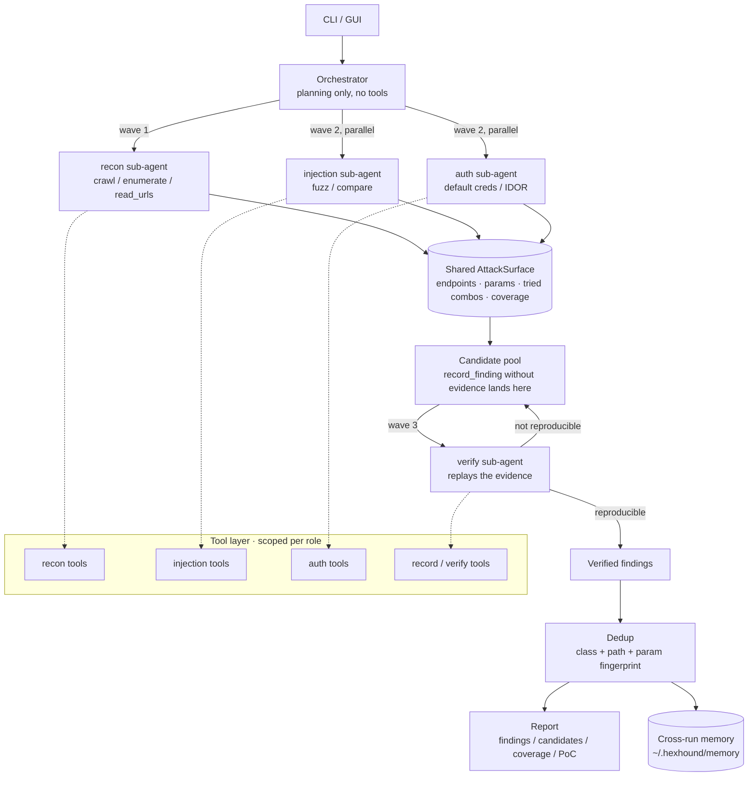

# HexHound 🐕‍🦺

> ⚠️ **Disclaimer**: HexHound is for **authorized testing** and **your own labs** only. Scanning,
> testing, or exploiting any system without written permission is illegal. By using this project
> you agree to comply with your local cyber-security law and responsible-disclosure rules.

**English** | [中文](README_ZH.md)

**HexHound** is an **LLM-driven black-box vulnerability scanner**. Give it a target URL; the LLM
acts as the brain, real HTTP requests are the hands, and a bundled lab is the referee. It runs the
full loop on its own — **recon → probe → verify → report** — and **only findings that are backed by
reproducible evidence end up in the report**.

The main mode is `blackbox`: an orchestrator splits the goal into sub-tasks, recon / injection /
auth sub-agents run **in parallel**, a verification sub-agent replays every candidate's evidence,
and the results are deduplicated into the report. Source review (`source`) is a secondary mode for
when you also have the code.

## Why an agent instead of just asking an LLM?

Handing a URL to an LLM and asking "is there a bug?" produces hallucinations, false positives, and
claims nobody can reproduce. HexHound makes the LLM work inside a *tool-calling, verifiable loop*:
every conclusion traces back to a real crawl, probe, or HTTP exchange.

| | Just ask an LLM | Classic scanner | HexHound |
| --- | --- | --- | --- |
| Where conclusions come from | Model guesswork | Fixed signatures | Real requests + HTTP evidence |
| False positives | Unfiltered | Triaged by a human | **Candidates and verified findings are separate**; only replayed findings reach the report |
| Decision making | One-shot answer | None | Orchestrator decomposes; role-specific sub-agents run concurrently |
| Duplicate work | — | — | Shared attack surface + tried-combination dedup; same root cause auto-merges |
| Coverage transparency | None | None | Two-layer coverage gate (endpoints **and** parameters) + OWASP matrix + explicit "tested, nothing found" notes |
| Cost control | None | None | Budget caps (tokens / money / requests / time) + wrap-up warnings |
| Safety boundary | None | None | Code-level host allowlist + read-only verification + rate limiting |

## Architecture



Four stages plus one verification gate:

```
recon (crawl/discover/enumerate/read_urls) → probe (fuzz/creds/IDOR)
   → verify (replay evidence; only reproducible findings are promoted)
   → record (dedup, then write a runnable PoC)
```

## Quick start

### Option A — use the prebuilt executable (no Python needed)

```
hexhound.exe providers      # list the 12 provider presets and where to get a key
hexhound.exe setup          # interactive wizard, writes .env next to the exe
hexhound.exe audit --target http://127.0.0.1:5000 --mode blackbox --verbose
```

When frozen, HexHound reads `.env` from the executable's own directory (or the current
directory) and writes reports to `%LOCALAPPDATA%\HexHound\reports`. `--output <path>` still
wins if you want the report somewhere specific.

### Option B — run from source

```bash
git clone <your-repo-url> && cd hexhound
pip install -e ".[lab]"
cp .env.example .env      # Windows: copy .env.example .env
# edit .env: pick LLM_PROVIDER and paste your key (or run `hexhound setup`)
```

### Start the bundled lab and run a scan

```bash
python vulnlab/app.py     # http://127.0.0.1:5000
```

The lab intentionally contains 13 vulnerability classes (SQLi, XSS, path traversal, SSRF, command
injection, SSTI, broken auth, IDOR, order-level access control, Actuator leak, plus **coupon race
condition, one-time-token race and JWT forging** — see "Beyond payloads" below). You can sanity-check
one by hand first:

```bash
# error-based SQL injection (a single quote leaks a full SQL error)
curl -s -X POST --data-urlencode "username='" --data-urlencode "password=x" http://127.0.0.1:5000/login
```

The three advanced classes are hand-verifiable without HexHound in the loop (5/5 checks pass):

```bash
wsl -d Ubuntu-24.04 -u root -- bash /mnt/c/.../HexHound/tools/verify_lab_new_vulns.sh
```

Then run the agent:

```bash
hexhound audit --target http://127.0.0.1:5000 --mode blackbox --verbose
# report -> reports/report.md, artifacts (PoC / surface / ledger) -> ~/.hexhound/runs/
```

**Zero-cost sanity check of the tool layer** (recommended as a first step):

```bash
python examples/tool_selftest.py       # 31 detection checks, no API key required
```

**No API key at all?** Drive the full orchestration with a scripted LLM:

```bash
SWARM_MOCK=1 python examples/swarm_demo.py   # plan -> parallel workers -> verify -> report
python examples/mock_demo.py                 # minimal single-agent demo
```

## Real-tool sandbox (the difference between "suspected" and "proven")

Beyond built-in HTTP probing, HexHound can drive **real pentest tools** inside an isolated
environment. This is the line between reporting "this parameter looks injectable" and handing over
a reproducible payload plus the data it extracted.

```bash
hexhound sandbox status     # what execution environment and tools are available
hexhound sandbox install    # install the toolchain into WSL (sqlmap/nmap/ffuf/nuclei/…)
hexhound sandbox templates  # install the nuclei template library (host download → WSL)
hexhound sandbox build      # build the bundled Kali-based image (docker/podman only)
hexhound sandbox lab        # run the vulnerable lab inside WSL (so tools can reach it)
```

### A note on "but I can reach GitHub"

If you run an accelerator such as **Steam++ / Watt Toolkit**, it does two things: it writes
`github.com` (and friends) into the Windows hosts file pointing at `127.0.0.1`, and it runs a local
reverse proxy on **port 443**. The result:

| Path | Reaches GitHub | Why |
| --- | --- | --- |
| Browser / Windows command line | ✅ | goes through the local 443 reverse proxy |
| `curl` inside WSL / a container | ❌ | **WSL does not read the Windows hosts file** — it has its own resolv.conf and hits the real GitHub, which gets reset |
| tools like `web_fetch` | ❌ | see `127.0.0.1`, classify it as a non-public address, and refuse before sending anything |

So `hexhound sandbox install` / `templates` download in tiers: **host-side first** (Windows goes
through the accelerator, then the file is moved into WSL via `/mnt/c` or base64), then GitHub proxy
mirrors (`ghproxy.net` / `gh-proxy.com`), then direct. Measured on this machine: a 27.7 MB nuclei
binary in 26 s and a 5 MB template bundle in 26 s from Windows, while the same WSL box gets `000`
from `github.com`.

### What nuclei is actually for (measured, don't be misled by the name)

| Category | Templates | Time |
| --- | --- | --- |
| `http/misconfiguration` | 508 | 20s |
| `http/exposures` | 216 | 33s |
| `http/default-logins` | 205 | 15s |
| **default set (four categories)** | ~930 | **66s** |
| `categories="full"` (includes cves) | 4488 | 146s / ~9600 requests |

It scans what **public templates** cover — known CVEs, exposures, default logins, admin panels — and
typically has **no template for business-logic or custom-code flaws**. Measured: 0 hits against the
bundled lab, where sqlmap confirmed an injection in 1.4 s. The tool description and the report both
say so: **0 hits from nuclei is not "no vulnerabilities"**, and coverage records it as
"nuclei template scan found nothing" rather than "clean".

**Three backends, auto-detected** — `docker` → `podman` → `wsl`. Docker Desktop is frequently
installed-but-broken, not started, or unreachable by the current user; very few machines are missing
`wsl.exe`, so HexHound still gets real tools there. (Strix and PentAGI both require working Docker.)

| Tool | Wired as | Role that gets it |
| --- | --- | --- |
| `sqlmap` | `sqlmap_scan` — confirms injection, reports payload/technique/DBMS, optionally dumps tables | injection, auth, verify |
| `nmap` | `port_scan` — open ports and service versions | recon, auth |
| `nuclei` | `template_scan` — templated CVE/config/exposure checks | recon, injection, verify |
| `ffuf` | `dir_bruteforce` — hidden path discovery (hits feed the shared attack surface) | recon |
| `whatweb` | `web_fingerprint` — component versions for A06 | recon |
| `nikto`/`gobuster`/`curl`/`python3` | `raw_command` — anything the presets don't cover | all roles (restricted) |

### Scope is enforced in code — including inside the sandbox

Both reference projects let the agent run whatever it wants inside the container. HexHound **extracts
every host from the command line** (URLs, bare domains, bare IPv4/IPv6) and validates each against
`ALLOWED_HOSTS` *before* execution; anything outside is refused. A tool allowlist (no shell
metacharacters, no `rm`/`bash -i`) and a destructive-flag blocklist (`--os-shell`, `--file-write`,
reverse-shell patterns, `DROP TABLE`) sit on top. Loopback rewriting happens *after* validation, so
the mapping can never widen the authorized scope.

Verified against the bundled lab:

```
$ hexhound.exe audit --target http://127.0.0.1:5000 --mode blackbox --sandbox-map-loopback
真工具沙箱：WSL (Ubuntu-24.04)（可用工具：curl, ffuf, gobuster, nikto, nmap, nuclei, python3, sqlmap, whatweb）
```

```
sqlmap -u 'http://127.0.0.1:5000/login' --batch --data="username=alice&password=x" \
       --dbms=sqlite --tables --dump
...
sqlmap identified the following injection point(s) with a total of 86 HTTP(s) requests:
Parameter: username (POST)
    Type: boolean-based blind
    Type: UNION query    Title: Generic UNION query (NULL) - 3 columns
[INFO] the back-end DBMS is SQLite    banner: '3.45.1'
Database: <current>   Table: users   [2 entries]
+----+-----------------+----------+
| id | password        | username |
+----+-----------------+----------+
|  1 | alice-demo-pass | alice    |
|  2 | bob-demo-pass   | bob      |
```

That last table is the whole point: the report can now show **impact evidence**, not just a signal.

### Tool evidence flows into findings

Tool runs get their own evidence ids (`T` prefix, e.g. `W2-T1`) alongside HTTP exchanges (`R`) and
code snippets (`C`). `record_finding(evidence_ref=["W2-T1"])` accepts any of the three, and the report
renders a **Real-tool evidence** block containing the exact command (with a comment showing the
original target when loopback mapping applied) and the tool's output. The model is told to write
sqlmap's payload/technique/DBMS into `evidence`, so a reader can re-run one command to confirm.

The sandbox wrapper locks its own safety flags: if the model adds `--risk=2 --level=3 --threads=8`
to a `sqlmap_scan` call, deduplication restores `--risk=1 --level=2 --threads=2` (first occurrence
wins), so the declared "read-only, lightweight" contract can't be silently bypassed.

### What the agent does with it (measured)

A 3-task run against the bundled lab, in 75 s for ¥0.073:

```
[OK] [critical] /login username 参数 SQL 注入（SQLite 布尔盲注 / UNION）
     → 漏洞证明：sqlmap 确认 POST username 可注入，后端 DBMS 为 SQLite 3.49.1
     → 证据：**W2-T1** · sqlmap · 成功 · 2.64s   （附完整命令与 5167 字符工具输出）
[OK] [critical] 未授权访问 /api/users 泄露全部用户 PII
[OK] [high] IDOR：/api/user?uid=N 匿名可读取任意用户完整资料
[OK] [high] 未授权访问 /api/order 泄露订单收货地址与手机号
[OK] [high] /file path 参数目录穿越任意文件读取
[OK] [high] /fetch url 参数 SSRF（支持 file:// 协议读取本地文件）
[OK] [medium] /reflect name 参数反射型 XSS
```

Because the planner runs *before* recon, it cannot see that `/login?username=` exists. So after
planning, HexHound applies a **deterministic bias**: if the surface has parameterized endpoints but
the plan contains no injection task, it appends (or rewrites) one that explicitly names `sqlmap_scan`.
Without this the real tools were never invoked — verified by repeated runs.

### Coverage is enforced in two layers, not one

Endpoint-level coverage ("was this URL requested at all?") is not enough, and a real run proved it:
recon had already `GET`-ed `/ping?ip=1` and `/ssti?name=x`, so both endpoints counted as *covered* —
while the `ip` and `name` parameters had never been attacked. The report showed 100% endpoint
coverage, and command injection and template injection went completely untested. That is a worse
failure than an obvious gap, because the report looked complete.

So the gate has two independent, deterministic judgements:

| Layer | Judgement | Consequence when it fails |
| --- | --- | --- |
| Endpoint | endpoint in `attempts ∪ findings ∪ coverage` | forced recon sweep wave, blind-spot list in the report |
| **Parameter** | `(endpoint, param)` present in an attempt record | forced **injection** sweep wave, per-parameter blind-spot list |

Both numbers are printed at the top of every report (`Endpoint coverage: 18/18`, `Parameter
coverage: 9/14`) and untested items get their own section — never silently omitted. Parameters are
ranked high-value-first (`login`/`search`/`detail`/`id`…), and the sweep task tells the sub-agent it
must leave *either* a finding *or* a `record_coverage` note per parameter, so "tested, nothing found"
is a recorded result rather than an absence.

> The sandbox runs in a separate network namespace. If your target listens on the *host* (e.g.
> `python vulnlab/app.py` on Windows), use `--sandbox-map-loopback` so loopback targets are rewritten
> to the host address (`192.168.160.1` under WSL, `host.docker.internal` under Docker Desktop).
> If the target already runs inside the sandbox (see `hexhound sandbox lab`), leave it off.
> Either way the report records which mode was used, and whether real tools ran at all.

### If the target and the tools are on different sides (WSL relay 502s)

A lab running **inside WSL** while HexHound runs on Windows is reachable through WSL2's localhost
relay — and that relay occasionally answers `502` for a few connections (the app itself never logs
them: `grep -c ' 502 ' /tmp/hexhound-lab.log` returns 0). Sub-agents then spend steps working around
it, or worse, record a transient failure as a conclusion.

Two ways to avoid it: run the lab **on the same side** as the tools (`hexhound sandbox lab start`
runs it in the sandbox), or point the target at the WSL address directly instead of `127.0.0.1`:

```bash
wsl -d Ubuntu-24.04 -- hostname -I          # e.g. 192.168.166.168
hexhound audit --target http://192.168.166.168:5000 --mode blackbox   # add it to ALLOWED_HOSTS
```

Measured: 40 concurrent requests through the relay → 40×`200` after a clean restart, but a stale
relay mapping (typically right after restarting the lab) produces intermittent 502s until it
re-resolves.

### PoCs verify themselves (they are not replay scripts)

Every verified finding produces a **shell PoC with assertions** (`poc/HH-00X.sh`) that decides for
itself whether the vulnerability still holds:

```bash
$ bash poc/HH-002.sh
-- step 1: GET http://127.0.0.1:5000/api/users (evidence W3-R1)
   status: 200
   [holds] W3-R1 still returns HTTP 200
   [holds] W3-R1 response still contains 'idcard'
== result: 2 hold / 0 broken / 0 failed ==
>>> still reproducible (not fixed)        # exit code 0
```

Exit codes: **0 = still reproducible / 1 = fixed or not reproducible / 2 = requests failed**.
So the PoC doubles as a regression check — re-run it after a fix and you know whether it actually
landed.

Assertions are derived deterministically from the evidence (response status, body markers, and
`injectable` / `back-end DBMS` markers in tool output) rather than trusting the model, and an
unreachable target is never counted as a pass (it takes the exit-code-2 branch).

### Duplicate requests short-circuit

Concurrent sub-agents constantly forget that a peer already fetched an endpoint. An identical request
(same method + URL + params + data + headers + JSON body) now **reuses the previous response snapshot**
inside the same task and says so; pass `refresh=true` to force a real re-send:

```
call 1: [W1-R1] HTTP 200 OK
call 2: [W1-R1] (reused: this exact request was already sent by this task)
call 3: [W1-R1] (reused: …)
requests actually sent: 1 | cache hits: 2
```

## Common commands

```bash
# Multi-agent black-box (default): 4 sub-tasks, 8 steps each, 3-way concurrency, ¥0.5 cap
hexhound audit --target http://127.0.0.1:5000 --mode blackbox \
  --max-tasks 4 --task-steps 8 --parallel 3 --max-cost 0.5 --verbose

# Single-agent ReAct loop (v0.1 behaviour, useful for comparison)
hexhound audit --target http://127.0.0.1:5000 --mode blackbox --single --max-steps 30

# Source review (secondary mode)
hexhound audit vulnlab --target http://127.0.0.1:5000 --mode source --verbose

# CI: exit code 2 when a high-or-worse verified finding exists
hexhound audit --target https://authorized-target --mode blackbox --fail-on high --output reports/ci.md

# Sandbox: what is available, install missing tools, refresh nuclei templates
hexhound sandbox status
hexhound sandbox install
hexhound sandbox templates

# Cross-run memory: inspect and prune (keeps the diff signal clean)
hexhound memory --target http://127.0.0.1:5000
hexhound memory --target http://127.0.0.1:5000 --list
hexhound memory --target http://127.0.0.1:5000 --before "2026-09-18"
hexhound memory --target http://127.0.0.1:5000 --forget HH-003 --forget HH-007
```

| Flag | Purpose |
| --- | --- |
| `--mode blackbox/source` | Pure-URL black box (main) / source review (secondary) |
| `--max-tasks` `--task-steps` `--parallel` | Sub-task count / steps per task / concurrency (`--parallel 1` is serial and cheaper) |
| `--max-cost` | Money cap for the run (CNY); crossing it ends the run gracefully |
| `--rate-limit` | Minimum gap between requests in seconds; use ≥0.2 against production |
| `--provider` `--model` `--base-url` | Pick a provider preset / override the model / point at a custom gateway |
| `--role-model ROLE=MODEL` | Per-role model (repeatable), e.g. `--role-model verify=deepseek-v4-pro` |
| `--single` | Fall back to the single-agent loop |
| `--fail-on LEVEL` | Exit code 2 when a finding at or above that severity was verified |
| `--verbose` | Print every tool call and observation |

> Measured reference (one read-only pass against a production site, 3 tasks × 12 steps, 3 parallel):
> ~120k tokens / ¥0.15 when sub-tasks wrap up early, ~760k tokens / ¥0.58 when all three run to the
> step cap and pull in large JS bundles. The difference comes from carrying the in-progress
> conversation on every step — which is why `--max-cost` matters more than reading the bill
> afterwards. Use `--task-steps 12` for broad sites, 8 for narrow ones.

### Re-render a report after manual review

Surface snapshots and the candidate pool live in `~/.hexhound/runs/<name>/`. After you review the
candidates you do not need to re-run anything:

```bash
hexhound report --run latest --target http://127.0.0.1:5000 \
  --promote HH-003 --exclude HH-007 \
  --output reports/final.md --json-out reports/final.json
```

`--promote` turns a confirmed candidate into a verified finding, `--exclude` drops a false positive.
No requests are sent and no LLM is called.

### Pruning cross-run memory

Memory is append-only, so it accumulates entries from older runs (including early scripted-model test
runs) that would otherwise resurface as `unknown` in every future diff and drown the real regression
signal. `hexhound memory` is the maintenance entry point — it lists entries with their report time and
fingerprint, and can drop them by id, by date, or wholesale:

```bash
hexhound memory --target http://127.0.0.1:5000 --list        # id / severity / title / url / when
hexhound memory --target http://127.0.0.1:5000 --before 2026-09-18   # drop older entries
hexhound memory --target http://127.0.0.1:5000 --reset --yes         # clear findings for this host
```

Pruning only touches the **findings** list. Target knowledge (`tech`, parameter hit history, notes) is
kept, because that is what makes the next run cheaper rather than noisier.

## Modes

| Mode | Requires | What it does | Example |
| --- | --- | --- | --- |
| `blackbox` (main) | target URL only | Orchestrator decomposes → recon/injection/auth run concurrently → verification → report | `hexhound audit --target http://127.0.0.1:5000 --mode blackbox` |
| `source` (secondary) | source dir + target URL | Read the code to locate suspects, then verify over HTTP | `hexhound audit vulnlab --target http://127.0.0.1:5000` |

Black-box mode is the standard workflow for **authorized bug-bounty / pentest engagements**. Add the
target host to `ALLOWED_HOSTS` in `.env` first, otherwise every request is refused:

```ini
ALLOWED_HOSTS=127.0.0.1,localhost,authorized-target.com
```

> ⚠️ Both modes are **read-only and non-destructive**. HexHound never touches any host outside
> `ALLOWED_HOSTS`.

## Model providers and per-role models

HexHound only speaks the **OpenAI-compatible protocol**, so switching models is just switching a
name. There are 12 built-in presets: DeepSeek, OpenAI, Anthropic, Gemini, Qwen/DashScope, Kimi,
Zhipu GLM, SiliconFlow, OpenRouter, local Ollama, local vLLM/LM Studio, and **custom** (gateways,
corporate proxies, self-hosted).

```bash
hexhound providers                 # list every preset + which keys are already configured
hexhound providers --test          # send one tiny request per configured provider
hexhound audit --target URL --provider qwen --model qwen-max
hexhound audit --target URL --provider custom \
  --base-url https://your-gateway/v1 --model your-model
```

The corresponding `.env` (generated by `hexhound setup` or the GUI panel):

```ini
LLM_PROVIDER=deepseek               # decides base_url and the default model
LLM_MODEL=deepseek-v4-flash
LLM_API_KEY=sk-...                  # shared key; per-provider keys take precedence

# Optional per-provider keys
PROVIDER_DEEPSEEK_API_KEY=sk-...
PROVIDER_OPENAI_API_KEY=sk-...
```

**Nothing is pre-selected.** With no `LLM_PROVIDER` configured, HexHound refuses to start and tells
you the four ways to configure it — it will never quietly run on someone's paid endpoint.

### Per-role models (cheap workers, strong reviewer)

```ini
LLM_VERIFY_MODEL=deepseek-v4-pro        # verification decides what gets reported
LLM_PLANNER_MODEL=deepseek-v4-pro       # planning too
# recon / injection / auth follow LLM_MODEL when left empty
```

```bash
hexhound audit --target URL --role-model verify=deepseek-v4-pro --role-model recon=deepseek-v4-flash
```

Roles without an override **reuse the default client** — you pay nothing extra for not configuring
them. The actual assignment is printed, stored in `run.json` and in each sub-task's ledger entry
(`model` field) so a run can be reproduced.

### GUI settings panel

`hexhound gui` → **Settings** → **Model provider**:

- pick a preset → base_url / model / key requirement auto-fill (type the model or pick from the list)
- **Test connection** sends one minimal request and classifies failures into actionable advice:
  401 → bad key; wrong model name → the provider's own list of valid models is shown verbatim;
  timeout reaching OpenAI/Anthropic from China → network/proxy hint
- **Write to .env** persists the current settings (comments and unrelated keys preserved, `.env.bak`
  written first)
- **Per-role models** in a collapsible section; leave blank to follow the default
- A successful test remembers that provider's key (masked in the UI, stored in
  `~/.hexhound/settings.json`)

## Tool set (scoped per role)

Tools are not handed to a single agent; they are issued **per role** — the orchestrator has no
probing tools at all, recon cannot write conclusions, and the verifier cannot open new attack
surface. That is a code-level "who may do what" constraint.

| Tool | Role | Purpose |
| --- | --- | --- |
| `crawl` | recon | Page title, tech fingerprint, same-origin links, forms and params, same-origin JS |
| `discover_endpoints` | recon | Extract API paths from HTML and same-origin JS (incl. fetch/axios calls) |
| `enumerate_common` | recon | Tiered sensitive-path probing (core/leak/admin/framework/api) with **random-path baseline to filter fake 404s** |
| `read_urls` | recon | Batch-read JS/config and scan for hardcoded secrets (AWS keys, JWTs, private keys) |
| `check_security_headers` | recon | Security headers / cookie flags / CORS (hardening issues are usually non-reportable) |
| `fuzz_params` | injection | Semantic parameter fuzzing (sqli/xss/ssti/fmt/cmd/path/ssrf/redirect/crlf/nosqli/xxe), **skipping combinations already tried** |
| `compare_responses` | shared | Baseline vs injected diff: status, length, headers, first differing fragment + two evidence ids |
| `http_request` | shared | Send a request (allowlisted, no redirect following, no cert validation) and snapshot it |
| `check_default_creds` | auth | Common default credentials (field names auto-detected); a hit registers account C |
| `use_account` | auth | Switch the active identity (A/B/C/anonymous) for subsequent requests |
| `auth_test` | auth | Request the same endpoint as two identities and diff the responses (IDOR / broken auth) |
| `record_finding` | injection/auth/verify | Record a finding; **without evidence it only becomes a candidate**; `verified=true` requires evidence ids and a reproduction note |
| `review_candidates` | verify | List the candidate pool with fingerprints, evidence ids and review guidance |
| `record_coverage` | shared | Record coverage conclusions (reported / no_issue_found / ruled_out / not_tested / blocked) |
| `leave_note` `think` | shared | Leave a lead for other sub-agents / reason explicitly without side effects |
| `task_create/list/update` | shared | Per-agent task list, so plans are written down and worked through |
| `save_artifact` | shared | Persist payloads/wordlists/snippets into the run's artifact directory |
| `capture_screenshot` `dynamic_crawl` | shared | Page screenshots / real headless-browser execution (needs playwright) |
| `list_files` `read_file` `search_code` | source | Source-review trio (path escape refused, ≤500 lines per call, regex search) |
| `finish_task` | shared | Wrap up a sub-task with a structured summary (mandatory closing action) |

## The verification gate: suspected ≠ confirmed

This is where HexHound differs most from an "AI scanner", and it works in three layers:

1. **Candidate pool** — `record_finding` without `evidence_ref` (or without a reproduction note)
   only registers a *candidate*. The report lists candidates in a separate section marked
   "did not pass the verification gate".
2. **Evidence-id validation** — `evidence_ref` entries must be ids that actually exist in this task
   (e.g. `W2-R3`). **Invented ids are rejected outright**, so a model cannot "cite" evidence that
   never existed.
3. **Verification sub-agent** — wave 3 replays each candidate's evidence request. Only findings that
   are still reproducible get promoted with
   `record_finding(verified=true, verification="...")`.

Two calibration rules on top: claiming `confidence=high` requires a `confidence_rationale`
(otherwise it is downgraded to medium), and `counterevidence` is encouraged — the report shows it
verbatim.

## Dedup and the shared attack surface

- **Dedup fingerprint** = `(vuln class, normalized path, param)`. `/user/1?id=3` and `/user/2?id=9`
  are the *same* SQL injection (same root cause); duplicate reports across sub-agents merge
  automatically and the merge count is recorded. Deterministic fingerprinting costs no tokens, is
  testable, and never "fails open".
- **Shared attack surface** — every sub-agent reads and writes one `AttackSurface`. Registered
  endpoints are not re-crawled, and already-tried `(endpoint, param, category, payload)`
  combinations are skipped, with the agent told *which* sub-agent already hit it and that it can go
  straight to verification. Concurrent workers therefore never duplicate each other's work.

## Cross-run diff: what changed since last time

Re-scanning a target you already scanned is the normal case in a retest engagement, and "the report
is shorter this time" is not an answer. Every run compares itself against the findings stored in
`~/.hexhound/memory/<host>.json` and classifies them into four buckets:

| Bucket | Meaning |
| --- | --- |
| **new** | found in this run, not in the previous one |
| **persisting** | reported before, still reproduced now |
| **possibly fixed** | the endpoint *was* retested this run and the issue did not reappear |
| **unknown** | reported before, **not retested this run** |

The last bucket is the point of the feature. **"Not tested" is never rendered as "fixed"** — that is
the single most common way a security report misleads its reader. Only endpoints this run actually
touched (attempts + findings + coverage records, normalised) are allowed to produce `possibly fixed`;
everything else stays `unknown` with the reason spelled out in the report. One matching rule is
deliberately relaxed: same class + same path with a different parameter still counts as *persisting*,
because older memory files (and POST-body parameters) do not always carry a `param`, and a false
"unknown" is worse than a slightly loose match.

The loop is closed in the other direction too: previous findings are injected into the planning prompt
as **regression targets**, so the planner is required to schedule at least one sub-task that retests
them. Without that, nothing would ever retest an old endpoint and every entry would decay into
`unknown` forever.

The diff shows up in three places: a terminal line after the run
(`new 1 | persisting 3 | possibly fixed 0 | unknown 2`), a `## Diff since the previous run` section in
the Markdown report, and a `diff` object in the JSON report (`counts`, plus per-finding
`fingerprint` / `reason` / `original_status`).

> Honest boundary: the diff is only as good as the coverage of *this* run. With a small
> `--max-cost` the run may touch few endpoints and most history lands in `unknown` — that is the
> feature reporting its own uncertainty, not a bug. Also note that both Strix and PentAGI ship no
> cross-run comparison at all (PentAGI has no structured finding model to compare), so this layer is
> HexHound-specific — it exists because findings carry deterministic fingerprints and a history file.

## Beyond payloads: race conditions, business logic, crypto implementation

The three classes above are the ones an LLM scanner usually cannot touch, and the reason is not the
model — it is the **interface**. A single tool call sends one request; a race condition *is* the
difference between one request and N simultaneous ones, and a forged token *is* a value you compute
yourself. Strix solves this with skill playbooks plus arbitrary Python in its Kali container
([`race_conditions.md`](https://github.com/usestrix/strix/blob/main/strix/skills/vulnerabilities/race_conditions.md),
[`business_logic.md`](https://github.com/usestrix/strix/blob/main/strix/skills/vulnerabilities/business_logic.md));
PentAGI's README states plainly that agent-authored attack scripts are *"conceptual or future work,
not a feature that is implemented today."*

HexHound now closes that gap with three pieces:

**1. `sandbox_script` — a script channel with two layers of scope enforcement.** Roles `injection`,
`auth` and `verify` can submit a Python program (≤20 KB) that runs inside the sandbox. Because a
script is far more expressive than a command line, the allowlist is enforced twice:

| Layer | Mechanism | What it stops |
| --- | --- | --- |
| Static | scan of URLs, bare IPv4/IPv6, quoted domains, forbidden patterns | a literal `http://evil.com`, `8.8.8.8`, `subprocess`, `os.system`, `/dev/tcp/`, `shutil.rmtree` |
| Runtime | the launcher installs an in-process guard that hijacks `socket.getaddrinfo` and `socket.socket.connect` **before** your code runs | `"e"+"vil.com"`, base64, f-strings, raw sockets — anything that resolves or connects without being allowlisted |

The guard is generated per run with the *mapped* allowlist, so a script can keep writing
`http://127.0.0.1:5000` and still work inside a sandbox network namespace. Honest boundary: this is a
Python-level guard plus a container, not a kernel sandbox — it is there to keep the agent inside your
authorized scope, and the container remains the isolation boundary.

**2. Deterministic task generation for these classes.** A first live run proved that prompting alone
is not enough: recon *did* discover `/wallet` and *did* write "use the leaked JWT secret to forge an
admin token" in its notes — and then nobody acted on it (0 crypto findings, 0 race findings). Same
failure mode as "the real tools were never invoked" from v0.3. So the orchestrator now scans the
attack surface and **mechanically dispatches**:

- state-changing semantics (`coupon`, `redeem`, `wallet`, `points`, `order`, `reset`, `claim`, `quota`…)
  → an injection task that must use `sandbox_script` for a barrier-synchronized concurrent burst;
- a protected endpoint (401/403 or `admin`/`manage` path) **plus** a leak source (`/actuator/env`,
  `config`, `.js`, `swagger`…) → an auth task that must recover the secret and forge a credential.

Both are skipped when the script channel is unavailable, so budget is never wasted on "tool not
available".

**3. The lab actually contains these bugs now, and they are hand-verifiable.** `tools/verify_lab_new_vulns.sh`
reproduces all of them without HexHound in the loop (5/5 checks):

```
[1] race: sequential 1st OK, 2nd rejected (409) → 6 concurrent requests → 6 successes, balance 0 → 1300
[2] race: one reset token consumed concurrently → 6 sessions issued
[3] crypto: no token 401, role=user 403, leaked-secret HS256 admin token 200, alg=none unsigned token 200
```

Measured, from the run that produced them: `sandbox_script` was invoked for endpoint sweeps and for
signing tokens; the report's appendix renders each script as a ```python block (7 of them in that run),
so a reviewer can read the exact forging code instead of a base64 blob. The two new findings —
"JWT secret leaked at /actuator/env → self-signed `role=admin` token reads the admin export" and
"`alg=none` unsigned token bypasses the same endpoint" — are both `critical`, both re-verified by the
verification wave, and both cite `T`-numbered script executions as evidence.

**What this still does not do.** It gives the agent the *means* to test these classes and a gate that
forces the attempt; it does not guarantee success. Getting there took four real fixes, each found by a
live run rather than by reasoning:

| Symptom in a live run | Actual cause | Fix |
| --- | --- | --- |
| every `sandbox_script` call failed with `SyntaxError` | the multi-line guard became a literal `\n` after `json.dumps` + bash, and `python3 -c` does not interpret that escape | single-line launcher + base64 payload written to a temp file, plus a self-check that refuses a launcher containing a newline |
| every endpoint recorded as **HTTP 502** | httpx `trust_env=True` picked up the **Windows registry** system proxy (`http://127.0.0.1:7892`) — env vars were empty; `trust_env=True → 502`, `False → 200` | target traffic goes direct by default; opt in with `HEXHOUND_HTTP_PROXY` (LLM calls unaffected) |
| the race task was never even dispatched | `/coupon` was never registered as an endpoint — the generic wordlist has no state-changing vocabulary, and reading `app.js` did not register what it contained | new `business` path tier (77 paths, on by default) + `read_urls` now registers every path it harvests from JS/HTML |
| the concurrency test concluded "no race" | the task said "serial first, then concurrent" — the serial request **consumed** the single-use code | the task objective now requires two different inputs (two codes, or two accounts) for baseline vs burst |

After those, the same lab and model produced both classes in a single run: `/coupon` TOCTOU
(serial `#1` succeeds `+100`, `#2` → `409`; `threading.Barrier(N=10)` → **10/10 succeed**, balance
`0 → 1000`, and `409` again afterwards — evidence `W5-T8`/`W5-T9`, scripts rendered in the appendix)
plus the leaked-JWT admin forgery. Earlier runs had needed 4–7 attempts on the same target.

Boundaries that remain: race windows on a real target need the right timing and load (often HTTP/2
single-packet tricks), and a narrow window can be missed at N=10; `alg=none` is rare in the wild;
weak-secret forging only works when a secret actually leaks; business logic still depends on the model
understanding *your* domain invariants; and "no duplicate effect at N=10" is a negative result at that
N, not a proof of safety — the report says so in those words.

## Budget and guardrails

```ini
MAX_COST=0.5          # CNY; crossing it ends the run and records the reason in the report
MAX_TOOL_CALLS=300    # total request cap
MAX_SECONDS=900       # wall-clock cap
RATE_LIMIT=0.3        # minimum gap between requests
MAX_TASKS=6           # sub-task cap
PARALLEL=3            # concurrent sub-agents
```

At **70% / 85% / 95%** of any limit, a wrap-up directive is injected into the conversation so the
model converges on its own instead of being cut off at the hard threshold (when it usually has no
time left to write conclusions). The same applies per sub-task: at 3 steps / 2 steps / at the cap it
is told to converge, to wrap up now, and to hand in a summary.

Sub-task states are reported honestly: `finished` / `unfinished (step cap)` /
`unfinished (budget)` / `unfinished (repeated actions)` / `failed`. **Unfinished ≠ no output** — its
tool results still count toward the attack surface and evidence, but the report says the job was not
completed instead of pretending it was.

## Artifacts and memory

```
~/.hexhound/
├── runs/<host>-<timestamp>/
│   ├── surface.json     # attack-surface snapshot (endpoints/params/fingerprints/tried combos/coverage)
│   ├── tasks.json       # sub-task ledger (role/steps/tokens/cost/model/conclusion)
│   ├── run.json         # run summary (budget, coverage, dedup stats)
│   └── poc/HH-001.sh    # runnable PoC: curl replay of the evidence requests, in order
└── memory/<host>.json   # cross-run memory: fingerprints, param hit history, past findings
```

On the next run against the same target, the long-term memory is injected into the planning prompt
("which parameters hit last time") and the surface can be reused from `surface.json`. The data root
defaults to `~/.hexhound` and can be moved with the `HEXHOUND_HOME` environment variable (handy for
tests/CI).

## Interactive setup wizard

```bash
hexhound setup     # asks for provider, per-role models, budget/concurrency/rate limit; writes .env
```

## GUI

```bash
hexhound gui       # default http://127.0.0.1:5001
```

The console offers: visual configuration (including orchestration and budget parameters), one-click
audit start, an **orchestration progress** view (plan → wave → sub-task start/end), a live step
stream, verified findings and candidates shown separately, report viewing and submission-package
download. Settings persist to `~/.hexhound/settings.json`.

There is also a built-in **image analysis** panel: upload a screenshot (an error page, a proof
screenshot) and have a multimodal model analyze it. Configure it through `VISION_API_KEY` /
`VISION_BASE_URL` / `VISION_MODEL` in `.env`.

## Building the executable

```bash
build_desktop.bat                     # installs deps, builds hexhound.exe, copies it to the root
python -m PyInstaller --noconfirm --clean HexHound.spec          # CLI build only
python -m PyInstaller --noconfirm --clean HexHound-desktop.spec  # desktop window build (needs pywebview)
```

`hexhound.exe` is a **console** build on purpose: an audit prints its plan, sub-task transitions,
findings and budget, and a windowed build would swallow all of it. The wizard and the settings panel
write `.env` next to the executable (or in the current directory), and reports go to
`%LOCALAPPDATA%\HexHound\reports` when frozen.

## Project layout

```
.
├── pyproject.toml            # hatchling build + [project.scripts] exposing hexhound / hexhound-desktop
├── hexhound.exe              # prebuilt CLI executable (console)
├── HexHound.spec             # PyInstaller config for the CLI build
├── HexHound-desktop.spec     # PyInstaller config for the desktop build
├── build_desktop.bat         # one-shot build script
├── packaging/                # PyInstaller entry points (absolute imports)
├── README.md / README_ZH.md  # English / Chinese docs
├── docs/
│   ├── HANDOVER.md                # **start here if you are an AI agent taking this over**
│   ├── optimization-plan.md       # v0.2 design notes and mapping
│   ├── reference-architecture.md  # portable mechanisms from Strix / PentAGI
│   └── research-notes/            # full technical briefs of both reference projects
├── src/hexhound/
│   ├── config.py             # env -> frozen config (providers / per-role models / budgets)
│   ├── providers.py          # provider presets: base_url, models, pricing, env var names
│   ├── llm.py                # OpenAI-compatible client + connectivity self-test + client pool
│   ├── prompts.py            # role prompts (orchestrator/recon/injection/auth/verify) + task prompts
│   ├── knowledge.py          # path wordlists / payload library / fingerprints / error regexes
│   ├── surface.py            # attack-surface model: endpoints, tried combos, candidates, coverage
│   ├── dedupe.py             # finding dedup fingerprint
│   ├── budget.py             # budget ledger: tokens/money/requests/time + warning bands
│   ├── memory.py             # run artifacts + task ledger + cross-run host memory
│   ├── tools.py              # tool registry (role-scoped) + 26 tools + output governor
│   ├── agent.py              # ReAct loop (budget-aware, layered compression, closing discipline)
│   ├── orchestrator.py       # plan -> waves -> verify -> dedup
│   ├── mockllm.py            # scripted LLM: exercises the whole pipeline without a key
│   ├── report.py             # report renderer (findings/candidates/coverage/ledger, md+json)
│   ├── console.py            # UTF-8 console handling (GBK-safe markers)
│   ├── butian.py             # Butian platform submission-field mapping
│   ├── submission.py         # submission package (ZIP with evidence attachments)
│   ├── screenshot.py         # headless Edge/Chrome screenshot
│   ├── browser.py            # playwright dynamic execution (rendered HTML / network / screenshot)
│   ├── login.py              # manual login-state capture (real login window -> cookies/token)
│   ├── vision.py             # multimodal image-analysis client
│   ├── gui.py                # Flask console (hexhound gui)
│   ├── desktop.py            # pywebview desktop shell
│   └── cli.py                # click CLI (audit / report / providers / setup / gui)
├── vulnlab/                  # deliberately vulnerable Flask lab (10 classes)
├── examples/
│   ├── tool_selftest.py      # 31 detection checks (no API key needed)
│   ├── swarm_demo.py         # end-to-end orchestration demo (SWARM_MOCK=1 works offline)
│   └── mock_demo.py          # minimal single-agent demo
└── tests/                    # 144 unit tests (fully offline)
```

## Safety boundaries and disclaimer

- **Host allowlist, enforced in code**: every network tool validates the parsed host against
  `ALLOWED_HOSTS` and refuses anything else — a tool-level block, not a prompt-level request.
- **Timeouts and read-only**: requests use `REQUEST_TIMEOUT` (10s default); `follow_redirects=False`
  prevents redirect-based allowlist bypass; certificate validation is off (labs are usually HTTP).
- **Rate limiting and budgets**: `RATE_LIMIT` spaces out requests; `MAX_COST` / `MAX_TOOL_CALLS` /
  `MAX_SECONDS` cap the whole run so a runaway scan is impossible.
- **Path escape protection**: `read_file` / `list_files` only reach inside the audit root; `../`
  escapes are refused.
- **Read-only discipline**: prompts and tools both require non-destructive verification — no data
  modification, no webshell uploads, no reverse shells, no exploitation beyond proof.
- **Compliance**: follow your local cyber-security law and responsible-disclosure rules, and only
  test targets you are authorized to test.

## Roadmap

- [x] Hand-written ReAct loop + black-box four-stage loop
- [x] Pure-URL black-box scanning (main) + optional source review
- [x] Host allowlist guardrails + OWASP Top 10 coverage
- [x] Bundled Flask lab + key-free demos
- [x] Markdown/JSON reports + Butian submission package + `hexhound setup`
- [x] Headless browser execution (dynamic_crawl / screenshots / vision / manual login)
- [x] Web console + desktop build + prebuilt `hexhound.exe`
- [x] **Shared attack-surface model + finding dedup fingerprint**
- [x] **Candidate → verification gate**: only replayed findings reach the conclusion section
- [x] **Layered task decomposition + concurrent role-scoped sub-agents**
- [x] **Budget control + wrap-up bands + runnable PoC artifacts + cross-run memory**
- [x] **Provider presets + per-role models + connectivity self-test**
- [x] **Real-tool sandbox** (sqlmap/nmap/nuclei/ffuf… auto-detected Docker/Podman/WSL) with `T`-numbered execution evidence
- [x] **Coverage gate**: deterministic untested-endpoint detection, forced sweep wave, blind-spot section
- [x] **Cross-run diff + regression re-testing**: new / persisting / possibly fixed / unknown, and *never* "not tested = fixed"
- [x] **Memory maintenance CLI** (`hexhound memory --list/--forget/--before/--reset`)
- [x] **Script channel + playbooks for race conditions, business logic and crypto/auth implementation**, with deterministic task dispatch and a lab that verifiably contains all three
- [ ] Dynamically adjust the plan mid-run (incremental subtask patches)
- [ ] Spill oversized tool output to disk and read it back on demand
- [ ] More lab vulnerability classes (deserialization / prototype pollution)
- [ ] Browser-backed XSS confirmation (currently string-reflection only, no JS execution)

## License

[MIT](./LICENSE)

## References

The v0.2 orchestration, verification gate and budget mechanisms were informed by the **open-source
implementations** of the following projects (not by copying their infrastructure — HexHound stays
single-process with zero external services, and supplies the code-level scope enforcement and
structured finding model that both of them lack). See `docs/reference-architecture.md` for the full
mapping:

- [usestrix/strix](https://github.com/usestrix/strix) — manager + workers multi-agent design,
  in-sandbox PoC validation, evidence-id validation, coverage tracking of negative results,
  budget warning bands.
- [vxcontrol/pentagi](https://github.com/vxcontrol/pentagi) — flow→task→subtask layering,
  delegation-only orchestrator, three-layer memory, tool output governor (16KB → summarize → 32KB
  head/tail), XML-sectioned prompts, repeated-tool-call supervision.
