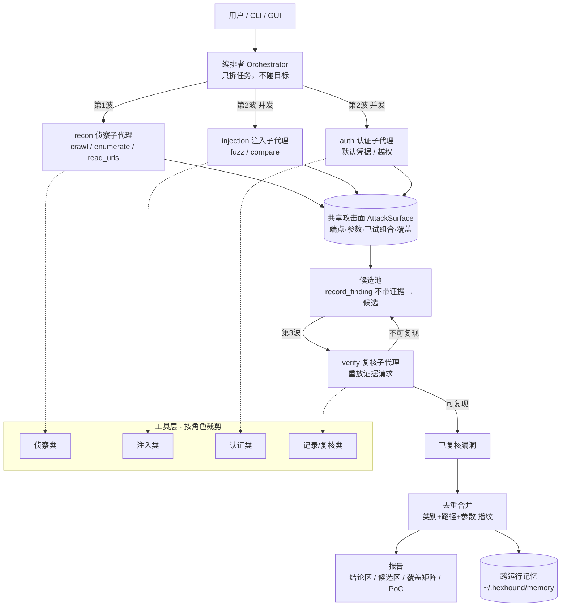

# HexHound 🐕‍🦺

> ⚠️ **免责声明**：HexHound 仅限**授权测试**与**自建靶场**使用。未经授权对任何系统进行扫描、测试或利用均属违法行为，后果由使用者自负。使用本项目即表示你同意遵守《中华人民共和国网络安全法》及漏洞披露规范。

[English](README.md) | **中文**

**HexHound** 是一个 **LLM 驱动的黑盒漏扫 Agent**：给它一个目标 URL，它就用 LLM 当"决策大脑"、真实 HTTP 请求当"手脚"、自带靶场当"裁判"，自动完成「攻面侦察 → 探测 → 复核 → 记录」的闭环，**只有证据成立、且经过复核的漏洞才进报告**。

主线是黑盒模式（`blackbox`）：编排者把目标拆成子任务 → 侦察/注入/认证子代理**并发**摸底与验证 → 复核子代理逐条重放证据 → 合并去重出报告。源码审计（`source`）是附带能力，仅在同时拥有源码时用于辅助定位可疑点。

## 为什么是 Agent，而不是直接问 LLM？

把目标 URL 直接丢给 LLM 问"有没有洞"，会得到大量幻觉、误报和无法复现的结论。HexHound 让 LLM 在"工具调用 + 可验证闭环"里工作，每个结论都来自真实的爬取、探测与 HTTP 请求证据。

| 维度 | 直接问 LLM | 普通扫描器 | HexHound |
| --- | --- | --- | --- |
| 结论来源 | 模型臆测 | 固定规则匹配 | 真实爬取/探测 + HTTP 证据 |
| 误报处理 | 无法判断 | 靠人筛 | **候选/已复核分离**，只有重放复现的才进结论区 |
| 决策方式 | 一次性回答 | 无 | 编排者拆任务 + 角色化子代理并发执行 |
| 重复劳动 | — | — | 共享攻面 + 已试组合去重，同一处漏洞自动合并 |
| 覆盖透明度 | 无 | 无 | 两层覆盖闸门（端点 + **参数**）+ OWASP 覆盖矩阵 + "测过没问题"的负面结论 |
| 成本控制 | 无 | 无 | 预算上限（token/费用/请求数/时间）+ 预警带收尾 |
| 安全边界 | 无 | 无 | 代码层主机白名单 + 只读验证 + 限速 |

## 架构



四段闭环 + 一道复核门，缺一不可：

```
侦察（crawl/discover/enumerate/read_urls） → 探测（fuzz/凭据/越权）
   → 复核（重放证据，可复现才提升） → 记录（去重后入库 + 生成可复现 PoC）
```

## 快速开始

### 方式 A —— 直接用现成的可执行文件（不需要 Python）

```
hexhound.exe providers      # 列出 12 个提供商预设，以及去哪拿 key
hexhound.exe setup          # 交互式向导，把 .env 写在 exe 旁边
hexhound.exe audit --target http://127.0.0.1:5000 --mode blackbox --verbose
```

打包运行时会从 **exe 所在目录**（或当前目录）读取 `.env`，报告默认写到
`%LOCALAPPDATA%\HexHound\reports`；想指定位置就用 `--output <路径>`。

### 方式 B —— 从源码运行

```bash
git clone <your-repo-url> && cd hexhound
pip install -e ".[lab]"
cp .env.example .env      # Windows: copy .env.example .env
# 编辑 .env：选一个 LLM_PROVIDER 并粘贴 key（或运行 hexhound setup）
```

### 启动靶场并跑一次扫描

```bash
python vulnlab/app.py     # http://127.0.0.1:5000
```

靶场里埋了 10 类漏洞（SQLi / XSS / 目录遍历 / SSRF / 命令注入 / SSTI / 未授权访问 / IDOR / 越权读订单 / Actuator 泄露），可以先手工验一条：

```bash
# 错误型 SQL 注入（单引号触发报错回显）
curl -s -X POST --data-urlencode "username='" --data-urlencode "password=x" http://127.0.0.1:5000/login
```

再跑 Agent：

```bash
hexhound audit --target http://127.0.0.1:5000 --mode blackbox --verbose
# 报告写入 reports/report.md，运行产物（PoC/攻面/台账）写入 ~/.hexhound/runs/
```

**先验证工具链，不花一分钱**（推荐第一次就这么做）：

```bash
python examples/tool_selftest.py       # 31 项工具检出能力自检（不需要 API key）
```

**完全不想配 key？** 用脚本 LLM 跑完整编排链路：

```bash
SWARM_MOCK=1 python examples/swarm_demo.py   # 规划→并发子代理→复核→报告
python examples/mock_demo.py                 # 单代理模式的最小演示
```

## 真工具沙箱（"疑似"与"证明"的分界线）

除了内置的 HTTP 探测，HexHound 能在隔离环境里驱动**真渗透工具**。这是"这个参数看起来能注入"与
"给你可复现的 payload + 我把数据取出来了"之间的差别。

```bash
hexhound sandbox status     # 看当前机器有什么执行环境、装了哪些工具
hexhound sandbox install    # 往 WSL 里装工具链（sqlmap/nmap/ffuf/nuclei…）
hexhound sandbox templates  # 安装 nuclei 模板库（宿主下载 → 传入 WSL）
hexhound sandbox build      # 构建自带的 Kali 精简镜像（仅 docker/podman）
hexhound sandbox lab        # 把靶场跑进 WSL（这样容器里的工具能打到它）
```

### 关于"能不能访问 GitHub"

如果你装了 **Steam++ / Watt Toolkit** 之类的加速器，它会做两件事：把 `github.com` 等域名写进
Windows hosts 指向 `127.0.0.1`，并在本地 **443 端口起一个反代**。结果是：

| 路径 | 能否上 GitHub | 原因 |
| --- | --- | --- |
| 浏览器 / Windows 命令行 | ✅ | 走本地 443 反代（hosts 指向 127.0.0.1） |
| WSL / 容器里的 curl | ❌ | **WSL 不读 Windows hosts**，有自己的 resolv.conf，直连真 GitHub 被重置 |
| `web_fetch` 这类工具 | ❌ | 解析到 `127.0.0.1` 后判为"非公网地址"直接拒绝，压根没发请求 |

所以 `hexhound sandbox install` / `templates` 的下载策略是**分层**的：

1. **宿主侧下载**（Windows 走加速器，最可靠）→ 再通过 `/mnt/c` 或 base64 传进 WSL；
2. GitHub 代理镜像（`ghproxy.net` / `gh-proxy.com`）；
3. 直连 GitHub（作为最后兜底）。

实测：Windows 侧下 27.7 MB 的 nuclei 二进制用 26 秒，下 5 MB 的模板包用 26 秒；
同一时刻 WSL 里直连 github.com 是 `000`（连不上）。

### nuclei 的真实定位（实测数据，别被名字误导）

| 类目 | 模板数 | 耗时 |
| --- | --- | --- |
| `http/misconfiguration` | 508 | 20s |
| `http/exposures` | 216 | 33s |
| `http/default-logins` | 205 | 15s |
| **默认四类目合计** | ~930 | **66s** |
| `categories="full"`（含 cves） | 4488 | 146s / ~9600 请求 |

默认只跑四个高性价比类目；要查已知 CVE 显式传 `categories="full"`。

**它扫的是公开模板覆盖的问题**（已知 CVE、暴露面、默认口令、后台面板），对业务逻辑和
自定义代码漏洞**通常没有模板**——实测对自带靶场 0 命中（而 sqlmap 1.4 秒就确认了注入）。
所以工具说明和报告里都写明了：**nuclei 0 命中不代表目标安全**，覆盖记录会记成
「nuclei 模板扫描无命中」而不是「无漏洞」。

**三种后端自动探测**：`docker` → `podman` → `wsl`。Docker Desktop 经常是"装了但坏了 / 没启动 /
当前用户没权限"，而没有 `wsl.exe` 的 Windows 机器很少——所以在 Docker 不可用时依然能用上真工具。
（Strix 与 PentAGI 都要求 Docker 可用。）

| 工具 | 接入为 | 下发给哪些角色 |
| --- | --- | --- |
| `sqlmap` | `sqlmap_scan`：确认注入 + 给出 payload/类型/DBMS，可选 dump 表数据 | injection / auth / verify |
| `nmap` | `port_scan`：开放端口与服务版本 | recon / auth |
| `nuclei` | `template_scan`：模板化 CVE/配置/泄露扫描 | recon / injection / verify |
| `ffuf` | `dir_bruteforce`：隐藏路径发现（命中自动写入共享攻面） | recon |
| `whatweb` | `web_fingerprint`：组件与版本（用于 A06 判定） | recon |
| `nikto`/`gobuster`/`curl`/`python3` | `raw_command`：预置工具覆盖不到时用 | 全部角色（受限） |

### 作用域在代码层强制——**容器内也一样**

那两个参考项目都是"让 agent 在容器里想跑什么就跑什么"。HexHound 会**先把命令行里出现的所有主机
抠出来**（URL、裸域名、裸 IPv4/IPv6），逐个过 `ALLOWED_HOSTS`，出现任何白名单外主机**直接拒绝执行**；
在此之上还有工具白名单（禁 shell 元字符、禁 `rm`/`bash -i`）与破坏性参数黑名单
（`--os-shell`、`--file-write`、反弹 shell 模式、`DROP TABLE`）。回环地址改写发生在**校验之后**，
所以地址映射不可能把授权范围放大。

对靶场的实测：

```
$ hexhound.exe audit --target http://127.0.0.1:5000 --mode blackbox --sandbox-map-loopback
真工具沙箱：WSL (Ubuntu-24.04)（可用工具：curl, ffuf, gobuster, nikto, nmap, nuclei, python3, sqlmap, whatweb）
```

```
sqlmap -u 'http://127.0.0.1:5000/login' --batch --data="username=alice&password=x" \
       --dbms=sqlite --tables --dump
...
Parameter: username (POST)
    Type: boolean-based blind
    Type: UNION query    Title: Generic UNION query (NULL) - 3 columns
[INFO] the back-end DBMS is SQLite    banner: '3.45.1'
Database: <current>   Table: users   [2 entries]
+----+-----------------+----------+
| id | password        | username |
+----+-----------------+----------+
|  1 | alice-demo-pass | alice    |
|  2 | bob-demo-pass   | bob      |
```

最后这张表就是重点：报告能给出**影响实证**，而不只是一个信号。

### 真工具证据会流进 finding

真工具执行有独立编号（`T` 前缀，如 `W2-T1`），与 HTTP 交换（`R`）、代码片段（`C`）并列。
`record_finding(evidence_ref=["W2-T1"])` 三类都认，报告会渲染**真工具执行证据**块：
确切的命令（发生回环映射时会附注释说明原始目标）+ 工具输出原文。
提示词要求模型把 sqlmap 给出的 payload / 注入类型 / DBMS 写进 `evidence`，
读者重跑一条命令就能验证。

沙箱封装会**锁定自己的安全参数**：如果模型在 `sqlmap_scan` 里自加 `--risk=2 --level=3 --threads=8`，
去重逻辑会把它们还原成 `--risk=1 --level=2 --threads=2`（保留第一次出现的值），
所以声明的"只读、轻量"契约无法被悄悄绕过。

### 模型实际跑出来的结果（实测）

3 个任务打自带靶场，75 秒 / ¥0.073：

```
[OK] [critical] /login username 参数 SQL 注入（SQLite 布尔盲注 / UNION）
     → 漏洞证明：sqlmap 确认 POST username 可注入，后端 DBMS 为 SQLite 3.49.1
     → 证据：**W2-T1** · sqlmap · 成功 · 2.64s   （附完整命令与 5167 字符工具输出）
[OK] [critical] 未授权访问 /api/users 泄露全部用户 PII
[OK] [high] IDOR：/api/user?uid=N 匿名可读取任意用户完整资料
[OK] [high] 未授权访问 /api/order 泄露订单收货地址与手机号
[OK] [high] /file path 参数目录穿越任意文件读取
[OK] [high] /fetch url 参数 SSRF（支持 file:// 协议读取本地文件）
[OK] [medium] /reflect name 参数反射型 XSS
```

因为**编排发生在侦察之前**，编排者看不到"有 `/login?username=` 这个端点"。所以计划出来后
HexHound 会做一次**确定性偏置**：攻面里有带参端点、计划里却没有注入类任务时，
自动补一个（或改写一个）明确写了 `sqlmap_scan` 的任务。没有这一步，真工具永远不会被调用
（多次实跑复现过）。

### 覆盖率是两层判据，不是一层

只判"这个 URL 请求过没有"是不够的，实跑证明了这一点：侦察子代理已经 `GET` 过
`/ping?ip=1` 与 `/ssti?name=x`，两个端点因此都算**已覆盖**——而 `ip` 与 `name` 这两个参数
从来没被攻击过。报告显示端点覆盖 100%，命令注入与模板注入却完全没测。
这比明显的漏测更糟：**报告看起来是完整的**。

所以闸门有两层各自独立的确定性判据：

| 层级 | 判据 | 不达标时的后果 |
| --- | --- | --- |
| 端点 | 端点在 `attempts ∪ findings ∪ coverage` 里 | 强制补扫波（侦察角色）+ 报告盲区清单 |
| **参数** | `(端点, 参数)` 出现在尝试记录里 | 强制**注入**补扫波 + 逐参数的盲区清单 |

两个数字都印在每份报告开头（`端点覆盖：15/16`、`参数覆盖：6/14`），未测项单独成节，
**绝不静默省略**。参数按价值排序（`login`/`search`/`detail`/`id`… 优先），补扫任务的提示词
要求子代理**要么留下漏洞记录、要么留下 `record_coverage` 结论**——"测过没问题"因此是一条
记录下来的结果，而不是一片空白。补扫最多跑两轮，且**只在盲区确实缩小时**才继续第二轮。

> 沙箱在独立的网络命名空间里。如果目标监听在**宿主机**上（例如 Windows 上 `python vulnlab/app.py`），
> 加 `--sandbox-map-loopback`，回环目标会被改写成宿主可达地址（WSL 下是 `192.168.160.1`，
> Docker Desktop 下是 `host.docker.internal`）。如果目标本身就跑在沙箱里（见 `hexhound sandbox lab`），
> 就不要开这个开关。两种情况报告里都会记录用的是哪种模式，以及本次是否真的跑了真工具。

### PoC 能自校验（不是"重放脚本"）

每条已复核漏洞会生成一个 **带断言的 shell PoC**（`poc/HH-00X.sh`），它自己判断漏洞是否仍然成立：

```bash
$ bash poc/HH-002.sh
-- 步骤 1：GET http://127.0.0.1:5000/api/users（证据 W3-R1）
   实际状态码：200
   [成立] W3-R1 仍返回 HTTP 200
   [成立] W3-R1 响应仍包含 'idcard'
== 结论：成立 2 项 / 不成立 0 项 / 请求失败 0 项 ==
>>> 漏洞仍可复现（未修复）          # 退出码 0
```

退出码语义：**0 = 仍可复现 / 1 = 已修复或无法复现 / 2 = 请求失败**。
所以它同时是复现脚本和**回归检查**——修完再跑一次就知道有没有真修掉。

断言从证据里确定性推导（响应状态码、响应体特征串、真工具输出里的 `injectable`/`back-end DBMS`），
不依赖模型自觉；"打不通"不会被误判成"通过"（走的是退出码 2 这一支）。

### 重复请求会短路

并发子代理经常"忘了别人已经请求过这个端点"。现在相同请求（方法+URL+参数+表单+头+JSON 体）
在同一任务里第二次调用会**直接复用上次的响应快照**并标注「复用」，需要强制重发时传 `refresh=true`：

```
第1次: [W1-R1] HTTP 200 OK
第2次: [W1-R1]（复用：本任务已发过完全相同的请求，未重复发送；如需强制重发请加 refresh=true）
第3次: [W1-R1]（复用：…）
实际发出的请求数: 1 | 缓存命中: 2
```

## 输出有界、原文不丢、过程可离线审计

三件事针对同一个失效模式：**Agent 看到的东西比它产出的少，而没人知道它到底做了什么。**

**1. 超长工具输出有上限，但绝不丢。** 超过 16 KiB 的内容会压缩给模型看，
同时整段原文进本次运行的 spill store，模型拿到一个 opaque 句柄，
可以用**专用工具**读回：

```bash
# 工具返回值里会写：[完整输出已保存] 句柄 SO-3b4bf44073ddfd7c0f2d30c145daaeec
spill_read(handle="SO-3b4bf4…", offset=0, limit=8000)     # 分页
spill_read(handle="SO-3b4bf4…", search="injectable")      # 字面量搜索
```

句柄是 `SO-` + 128 位随机数——不是自增序号、不是内容哈希，也不含路径，
因此**没有路径参数可以被滥用**，也读不到别的运行的内容（默认按运行存在内存里）。
配额分三级（单条 256 KiB / 单次运行 32 MiB / 累计 512 MiB），用尽时**如实报告**
而不是假装存下了。元数据记录 `original_size` / `stored_size` / `truncated` / `sha256`，
复核者可以确认"拿到的就是当时那段"。失败、超时、被作用域拒绝的输出**同样保存**——
"sqlmap 为什么什么都没跑出来"只能从报错里看出来。

**2. 每次运行都写 `trace.jsonl`。** 追加写、逐条 flush，所以运行被中断也读得到
中断前发生了什么。每行是一个事件：模型步骤（动作、参数摘要、观察摘要、阶段、
证据引用）、工具调用（名称、耗时、退出码、输出大小、溢写句柄、错误）、
finding、coverage、预算快照，或编排事件（计划、波次、补扫、时间闸门拒绝、重规划决策）。
敏感字段**写盘前**就掩码：按键名（`Authorization`/`Cookie`/`token`/`password`…）、
按值的形态（`sk-…`、JWT、`AKIA…`、PEM 头）、以及自由文本里的 `hh_session=…`。
键名与长度保留——审计仍能看出"当时带了这个头"，但还原不出原值。

**3. 报告可以在不碰目标、不叫模型的情况下重渲染。** `snapshot.json` 存了渲染器
需要的全部状态：

```bash
hexhound report --run latest --target http://127.0.0.1:5000 \
  --output reports/final.md --trace --trace-out reports/trace.json
```

测试用**会抛异常的** `httpx.request` 与 LLM 客户端替身来证明这条路径真的离线。
快照带自己的 schema 版本与迁移链（无版本 → v1 → v2）；比快照更早的运行目录会回退到
`surface.json` + `tasks.json`，并在报告里**明说**轨迹与工具证据当时没有记录——
而不是让读者以为那部分本来就是空的。

## API 合约导入（OpenAPI 3 / Swagger 2）

```bash
hexhound audit --target http://127.0.0.1:5000 --mode blackbox \
  --api-spec ./openapi.yaml --output reports/api.md
```

导入的接口会写进**共享攻面**，因此覆盖率闸门会强制它们：算作未触碰端点、
声明的参数进入参数级盲区清单，而且**导入本身不把任何东西标成已测**。
规划者会收到独立的 `<api_contract>` 段落。

安全模型刻意与 Strix 相反：规范是**不可信输入**，所以它的
`servers` / `host` / `schemes` / `basePath` 会被记进报告、然后**被忽略**——
每个接口都锚定在你指定的 `--target` 上。外部 `$ref` 默认拒绝；本地引用必须留在
规范根目录内（先文本查 `..`，再用解析后的路径做归属复核）；可选的远程引用走
**与目标请求同一份** `ALLOWED_HOSTS` 校验。协议相对路径（`//evil.example.com/x`）
与绝对 URL 直接拒绝，不以 `/` 开头的路径**报错而不是静默补斜杠**。
每一条被跳过的接口/参数都会写明原因。YAML 用自实现的子集解析，并**主动拒绝**
锚点、别名、自定义标签与多文档——那是 YAML 炸弹与 `!!python/object` 反序列化的入口——
拒绝时给出具体行号。

## 浏览器实跑的 XSS：反射不等于执行

```bash
pip install playwright && python -m playwright install chromium   # 可选
```

`browser_verify_xss` 用真实浏览器打开页面，返回**分级**结论——因为
"payload 在响应里"和"payload 执行了"是两个不同的发现：

| 级别 | 证据 | 报告里可以怎么写 |
| --- | --- | --- |
| `executed` | DOM 标记被改写 / 全局变量被设置 / 弹出对话框 | **确认的 XSS** |
| `dom` | payload 进了渲染后的 DOM，没有任何执行 | 进了 DOM，未确认执行 |
| `reflected` | payload 只在原始响应里 | 反射——**不是** XSS |
| `blocked` | 出现了但被 CSP/浏览器策略拦下 | 不可利用 |
| `absent` | 哪儿都没有 | 未反射 |

只有 `executed` 会置 `confirmed`，且每个级别的**措辞在代码里写死并回显在工具结果里**，
模型无法把"反射"升级成"确认 XSS"。作用域在**打开页面之前**校验一次，
并按重定向后的最终 URL **再校验一次**（一次跳转就足以离开范围）；
只允许 http/https，`file:` 与 `data:` 直接拒绝。默认载荷无破坏性——
只给自己的 DOM 打一个标记属性，并且避开 `alert()`（headless 下会阻塞页面）
与裸 `<script>`（只有在直接注入解析流时才执行，会把属性上下文与 innerHTML 注入误判成"不执行"）。
每次验证都保存原始响应体、渲染后 DOM、console、对话框、网络、Cookie 与 PNG 截图，
截图作为 `S` 编号证据。Playwright 保持可选：没装就**不下发**这个工具，
而 `fuzz_params` 的 xss 类别照常可用，所以"没装浏览器"永远不会悄悄变成"XSS 没测"。

靶场里有一组**对照组**让这个区分可复核：`/reflect`、`/reflect-text`、
`/reflect-dom`、`/reflect-csp` 四个端点都会原样回显，字符串级别完全一样，
但**只有 `/reflect` 会执行**。

## 收敛：受限收尾回合、有界重规划、监督器

子任务把步数用光却没调 `finish_task` 时，现在会得到**最多两个受限收尾回合**，
工具白名单是 `record_finding` / `record_coverage` / `leave_note` / `finish_task`。
其它动作会被拒绝**且不执行**，所以多出来的轮次不可能变成新一轮扫描——
总 LLM 请求数是 `max_steps + 2`，是算术而不是承诺。模型仍不总结时，
系统按**已落库的事实**代写一份（步数、动作分布、finding 与 coverage 计数），
该任务标为 `closing_no_finish`：产出保住了，但"模型自己收的尾"与
"系统不得不代收"仍然分得清。provider 报错、预算中止、监督器中止都是明确终态，
且保留已经记录的步骤、发现与覆盖。

重规划**只在波次边界**发生，且只能用结构化 patch（增/改/删），上限写在代码里：
每次最多新增 3 个任务、最多 3 轮、总任务 40、依赖深度 4。
`update` 改不了 id/role/url——那会让台账、证据归属或攻击目标与实际执行对不上。
**重规划不能扩大授权范围**：新增任务的主机必须等于本次运行的目标主机，
这比"在白名单内"更严，因为一次运行可能白名单里有多个主机而只授权其中一个。
任务 ID 由内容派生，同一输入得到同一组 ID，因此一次运行可重放。

监督器盯三类停滞，各有告警与中止两个阈值：完全相同的工具调用、
连续多步没有新证据、同一个失败反复出现。判定与动作分离，
每次干预都写进 trace，中止是**优雅**的——告诉子代理固化发现并收尾，而不是直接掐断。

## 自己验证一遍

```bash
python -m pytest                                    # 664 passed, 1 skipped
python -m ruff check src tests                      # All checks passed
python examples/tool_selftest.py                    # 31 项检出能力，不需要 key
SWARM_MOCK=1 python examples/swarm_demo.py          # 完整编排，不调模型
wsl -d Ubuntu-24.04 -u root -- bash /mnt/c/.../tools/verify_lab_new_vulns.sh      # 5/5
wsl -d Ubuntu-24.04 -u root -- bash /mnt/c/.../tools/verify_lab_business_logic.sh # 7/7
```

> WSL 里的靶场是**独立副本**：在 Windows 侧改 `vulnlab/app.py` 不会影响
> `/opt/hexhound-lab/app.py`。要先把文件拷过去、再重启靶场（按**端口**杀进程，
> 不要按命令行匹配），新端点才会存在。

## 常见命令

```bash
# 黑盒多代理（默认）：4 个子任务、每任务 8 步、3 路并发、费用上限 ¥0.5
hexhound audit --target http://127.0.0.1:5000 --mode blackbox \
  --max-tasks 4 --task-steps 8 --parallel 3 --max-cost 0.5 --verbose

# 单代理 ReAct（v0.1 行为，便于对比）
hexhound audit --target http://127.0.0.1:5000 --mode blackbox --single --max-steps 30

# 源码审计（附带能力）
hexhound audit vulnlab --target http://127.0.0.1:5000 --mode source --verbose

# CI：存在 high 及以上已复核漏洞时退出码 2
hexhound audit --target https://authorized-target --mode blackbox --fail-on high --output reports/ci.md

# 沙箱：查看可用环境 / 安装缺失工具 / 更新 nuclei 模板
hexhound sandbox status
hexhound sandbox install
hexhound sandbox templates

# 跨运行记忆：查看与清理（保证 diff 的信噪比）
hexhound memory --target http://127.0.0.1:5000
hexhound memory --target http://127.0.0.1:5000 --list
hexhound memory --target http://127.0.0.1:5000 --before "2026-09-18"
hexhound memory --target http://127.0.0.1:5000 --forget HH-003 --forget HH-007
```

| 参数 | 作用 |
| --- | --- |
| `--mode blackbox/source` | 纯 URL 黑盒（主力）/ 源码审计（附带） |
| `--max-tasks` `--task-steps` `--parallel` | 子任务数 / 每任务步数 / 并发数（`--parallel 1` 串行更省额度） |
| `--max-cost` | 本次运行费用上限（人民币），越线优雅收尾 |
| `--rate-limit` | 每次请求最小间隔秒数，对生产目标建议 ≥0.2 |
| `--provider` `--model` `--base-url` | 选提供商预设 / 覆盖模型 / 指向自定义网关 |
| `--role-model 角色=模型` | 按角色指定模型（可重复），如 `--role-model verify=deepseek-v4-pro` |
| `--single` | 退回单代理循环 |
| `--fail-on 等级` | 命中该等级及以上已复核漏洞时返回退出码 2 |
| `--verbose` | 打印每一步的工具调用与观察结果 |

> 实测参考（对生产站点做一次只读评估，3 任务 × 12 步、并发 3）：
> 一次约 12 万 token / ¥0.15（子任务早早收尾），一次约 76 万 token / ¥0.58
> （3 个子任务都跑满步数、且读了多个大 JS 文件）。差别主要来自"每步都要携带推进中的对话"，
> 因此**给 `--max-cost` 兜底比事后看账单重要**；宽站点建议 `--task-steps 12`，窄站点 8 就够。

### 离线重渲染报告（人工复核后收口）

审计跑完后，攻面与候选都落在 `~/.hexhound/runs/<名>/`。人工复核候选后不必重跑：

```bash
hexhound report --run latest --target http://127.0.0.1:5000 \
  --promote HH-003 --exclude HH-007 \
  --output reports/final.md --json-out reports/final.json
```

`--promote` 把确认的候选提升为已复核，`--exclude` 剔除误报，全程**不发请求、不调 LLM**。

### 清理跨运行记忆

记忆是只增不减的累积文件，会堆进旧运行（包括早期脚本模型试跑）留下的条目——它们会在
之后**每一次** diff 里以"状态未知"重复出现，把真正的回归结论淹没。`hexhound memory`
是维护入口：列出条目（含上报时间与指纹），并支持按编号、按时间、或整体清理：

```bash
hexhound memory --target http://127.0.0.1:5000 --list        # 编号 / 等级 / 标题 / URL / 上报时间
hexhound memory --target http://127.0.0.1:5000 --before 2026-09-18   # 删除该时间之前的条目
hexhound memory --target http://127.0.0.1:5000 --reset --yes         # 清空该目标的历史漏洞条目
```

清理只动**漏洞条目**；目标经验（`tech`、参数命中历史、notes）会保留——那些是让下次运行
更省的东西，不是噪音。

## 两种模式

| 模式 | 需要什么 | 干什么 | 命令示例 |
| --- | --- | --- | --- |
| `blackbox`（主力） | 仅目标 URL | 编排者拆任务 → 侦察/注入/认证并发 → 复核 → 报告 | `hexhound audit --target http://127.0.0.1:5000 --mode blackbox` |
| `source`（附带） | 源码目录 + 目标 URL | 先读源码定位可疑点，再黑盒验证 | `hexhound audit vulnlab --target http://127.0.0.1:5000` |

黑盒模式是**已获授权的漏洞赏金 / 渗透项目**的标准用法。使用前必须把目标主机加进 `.env` 的 `ALLOWED_HOSTS`，否则会被白名单拒绝：

```ini
ALLOWED_HOSTS=127.0.0.1,localhost,authorized-target.com
```

> ⚠️ 两种模式都**只做只读、非破坏性验证**，绝不扫描、不访问 `ALLOWED_HOSTS` 之外的任何主机。

## 模型提供商与按角色分配模型

HexHound 只依赖 **OpenAI 兼容协议**，所以换模型 = 换一个名字。内置 12 个预设：
DeepSeek、OpenAI、Anthropic、Gemini、通义千问/百炼、Kimi、智谱 GLM、硅基流动、OpenRouter、
本地 Ollama、本地 vLLM/LM Studio，以及"自定义"（中转站、公司网关、私有部署）。

```bash
hexhound providers                 # 看全部预设 + 当前 .env 里配了哪些 key
hexhound providers --test          # 对已配 key 的提供商各发一次最小请求验证连通性
hexhound audit --target URL --provider qwen --model qwen-max      # 一条命令换提供商
hexhound audit --target URL --provider custom \
  --base-url https://your-gateway/v1 --model your-model           # 自定义端点
```

`.env` 里对应这样写（`hexhound setup` 或 GUI 面板会自动生成）：

```ini
LLM_PROVIDER=deepseek               # 决定 base_url 与默认模型
LLM_MODEL=deepseek-v4-flash
LLM_API_KEY=sk-...                  # 共享 key（每家也可以用专用 key，优先级更高）

# 各家提供商的专用 key（可选）
PROVIDER_DEEPSEEK_API_KEY=sk-...
PROVIDER_OPENAI_API_KEY=sk-...
```

**默认不预设任何提供商**：没配 `LLM_PROVIDER` 时 HexHound 会拒绝启动并列出四种配置方式——
它不会悄悄按某一家的付费接口跑起来。

### 按角色分配模型（省钱又保质量）

```ini
LLM_VERIFY_MODEL=deepseek-v4-pro        # 复核决定"是否上报"，值得用最强模型
LLM_PLANNER_MODEL=deepseek-v4-pro       # 拆任务也值得
# recon / injection / auth 不写就跟随 LLM_MODEL（便宜快）
```

```bash
hexhound audit --target URL --role-model verify=deepseek-v4-pro --role-model recon=deepseek-v4-flash
```

未配置的角色直接复用默认客户端，**不配就不多付任何代价**。每次运行的实际分配会写进
控制台、`run.json` 与子任务台账（`model` 字段），便于复现。

### 设置面板（GUI）

`hexhound gui` → 「设置」→「模型提供商」：

- 下拉选预设 → base_url / 模型名 / 密钥要求自动回填（模型名可直接输入或从下拉选）
- **测试连接**：发一次十几 token 的最小请求，把失败原因归类成可读建议——
  401 → key 无效；模型名错 → 直接把提供商返回的合法模型名列出来；
  国内直连超时 → 提示网络/代理问题
- **写入 .env**：一键把当前配置写进 `.env`（保留注释与其它键，写前自动备份 `.env.bak`）
- **按角色指定模型**：折叠区里逐角色填，留空即跟随默认
- 测通后自动记住该提供商的密钥（界面只回显掩码，存在 `~/.hexhound/settings.json`）

## 工具集（按角色裁剪）

工具不是一股脑给同一个 agent，而是**按角色下发**——编排者没有任何探测工具，
侦察者不能写结论，复核者不再开拓新面。这是"谁能做什么"的代码级约束。

| 工具 | 角色 | 作用 |
| --- | --- | --- |
| `crawl` | recon | 爬页面：标题/技术栈指纹/同域链接/表单与参数/同域 JS 地址 |
| `discover_endpoints` | recon | 从 HTML 与同域 JS 提取疑似 API 路径（含前端 fetch/axios 调用） |
| `enumerate_common` | recon | 分档探测敏感路径（core/leak/admin/framework/api），**随机路径基线过滤假 404** |
| `read_urls` | recon | 批量读 JS/配置，自动扫描硬编码密钥（AK/JWT/私钥/云密钥） |
| `check_security_headers` | recon | 安全头 / Cookie 标志 / CORS（配置加固类通常不可提交，仅参考） |
| `fuzz_params` | injection | 按参数语义定向注入（sqli/xss/ssti/fmt/cmd/path/ssrf/redirect/crlf/nosqli/xxe），**自动跳过已试过的组合** |
| `compare_responses` | 通用 | 基线 vs 注入精确对比：状态码/长度/响应头/首个差异片段 + 两个证据编号 |
| `http_request` | 通用 | 发请求（白名单校验、不跟随重定向、不校验证书），完整保存请求/响应 |
| `check_default_creds` | auth | 常见默认凭据（字段名自动猜），命中会话自动注册为账号 C |
| `use_account` | auth | 切换身份 A/B/C/匿名，后续请求自动带该身份 |
| `auth_test` | auth | 两个身份请求同一接口并比较响应，发现越权/IDOR/未授权 |
| `record_finding` | injection/auth/verify | 记录漏洞；**不带证据只进候选池**，`verified=true` 必须带证据编号与复现说明 |
| `review_candidates` | verify | 列出候选池（指纹 + 证据编号 + 复核指引） |
| `record_coverage` | 通用 | 记录覆盖结论（reported / no_issue_found / ruled_out / not_tested / blocked） |
| `leave_note` `think` | 通用 | 给其他子代理留线索 / 显式推理 |
| `task_create/list/update` | 通用 | 子代理自己的任务清单（把计划写下来逐条推进） |
| `save_artifact` | 通用 | 把 payload/字典/脚本片段存进本次运行产物目录 |
| `capture_screenshot` `dynamic_crawl` | 通用 | 页面截图 / 无头浏览器真实执行（需 playwright） |
| `list_files` `read_file` `search_code` | source | 源码审计三件套（路径越界拒绝、单次 ≤500 行、正则搜索） |
| `finish_task` | 通用 | 子任务收尾并交回结构化总结（每个角色的必备动作） |

## 复核门：疑似 ≠ 成立

这是 HexHound 与"AI 扫描器"最大的区别，机制上分三层：

1. **候选区**：`record_finding` 不提供 `evidence_ref`（或缺少复现说明）时，只登记为**候选**，
   报告里单独成节并标注「没有通过复核门」。
2. **证据编号校验**：`evidence_ref` 必须是本任务真实产生过的编号（如 `W2-R3`），
   **编造的编号会被直接拒绝**——防止模型"引用"不存在的证据。
3. **复核子代理**：第 3 波专门重放候选的证据请求；只有亲眼看到仍可复现，才用
   `record_finding(verified=true, verification="...")` 提升为结论。

另外两条校准纪律：声称 `confidence=high` 必须给出 `confidence_rationale`（否则自动降为 medium）；
鼓励填写 `counterevidence`（反证/未排除的可能），报告会原样呈现。

## 去重与攻面共享

- **去重指纹** = `(漏洞类别, 归一化路径, 参数)`。`/user/1?id=3` 与 `/user/2?id=9`
  视为**同一处** SQL 注入（同一根因），跨子代理的重复上报会自动合并并记录合并次数。
  确定性的指纹去重不花 token、可测试、不会"失败开放"。
- **攻面共享**：所有子代理读写同一个 `AttackSurface`。已登记的端点不再重复爬；
  已试过的 `(端点, 参数, 类别, payload)` 组合会被跳过，并告知"哪个子代理已经命中、
  可以直接去复核"——并发子代理因此不会互相重复劳动。

## 跨运行差异：这次比上次变了什么

复测同一个目标是最常见的场景，而"这次报告短了"不是答案。每次运行都会和
`~/.hexhound/memory/<host>.json` 里的历史漏洞对比，分成四类：

| 分类 | 含义 |
| --- | --- |
| **新增**（new） | 本次才发现 |
| **仍存在**（persisting） | 上次报过、本次仍复现 |
| **疑似已修复**（possibly fixed） | 本次**确实重测了**该端点，问题未再出现 |
| **状态未知**（unknown） | 上次报过，但本次**没测到**该端点 |

最后一类才是这个功能的重点：**"没测到" 永远不会被写成 "已修复"**——这是安全报告里
最常见的误导手法。只有本次真正碰过的端点（尝试记录 + 漏洞 + 覆盖记录，统一归一化）
才允许判"疑似已修复"，其余一律记为"状态未知"并在报告里写明理由。匹配规则刻意留了一档
放宽：**同类漏洞 + 同路径、参数不同**仍算"仍存在"——旧的记忆文件与 POST 表单类漏洞
不一定带 `param` 字段，误报"未知"比稍微放宽匹配更糟。

反向的闭环也做了：历史漏洞会作为**回归测试目标**注入规划提示词，要求规划者至少安排
一个子任务去重测它们。没有这一步，没人会去重测旧端点，所有历史条目都会永远烂在
"状态未知"里。

diff 出现在三处：运行结束的终端行
（`新增 1 ｜仍存在 3 ｜疑似已修复 0 ｜状态未知 2`）、Markdown 报告的
`## 与上次运行的差异` 章节、以及 JSON 报告的 `diff` 对象（含 `counts` 与每条漏洞的
`fingerprint` / `reason` / `original_status`）。

> 诚实边界：diff 的可信度取决于**本次**的覆盖度。`--max-cost` 给得很紧时本次只碰到
> 少数端点，历史条目大多会落进"状态未知"——这是功能在如实报告自己的不确定性，不是 bug。
> 另外，Strix 与 PentAGI 都没有跨运行对比（PentAGI 连结构化漏洞模型都没有），这一层是
> HexHound 独有的：它的 finding 带确定性指纹，且有跨运行记忆文件。

## 单靠 payload 打不动的三类：竞态 / 业务逻辑 / 加密实现

这三类是 LLM 扫描器最常打不出来的，原因不在模型，而在**接口形态**：一次工具调用只能发一个
请求，而竞态**就是**"一个请求"和"N 个同时请求"之间的差别；伪造令牌**就是**一个需要你自己算出来
的值。Strix 的解法是 skill 手册 + 在 Kali 容器里跑任意 Python
（[`race_conditions.md`](https://github.com/usestrix/strix/blob/main/strix/skills/vulnerabilities/race_conditions.md)、
[`business_logic.md`](https://github.com/usestrix/strix/blob/main/strix/skills/vulnerabilities/business_logic.md)）；
PentAGI 的 README 则明确写着"agent 自己写攻击脚本属于**概念或未来工作**，不是今天已实现的功能"。

HexHound 现在用三件事补上这一块：

**1. `sandbox_script`：一条带两层作用域约束的脚本通道。** `injection` / `auth` / `verify`
三类角色可以提交一段 Python（≤20 KB）在沙箱里执行。脚本的表达力远强于命令行，所以白名单查两道：

| 层 | 机制 | 挡什么 |
| --- | --- | --- |
| 静态 | 扫描 URL、裸 IPv4/IPv6、引号里的域名、禁止片段 | 字面量 `http://evil.com`、`8.8.8.8`、`subprocess`、`os.system`、`/dev/tcp/`、`shutil.rmtree` |
| 运行时 | 启动器在**你的代码之前**接管 `socket.getaddrinfo` 与 `socket.socket.connect` | `"e"+"vil.com"`、base64、f-string 拼接、裸 socket——任何解析或连接都不放过 |

护栏里的白名单是**映射后**的地址集合，所以脚本里照样写 `http://127.0.0.1:5000` 就能在沙箱的
独立网络命名空间里跑通。诚实边界：这是 Python 级护栏 + 容器，不是内核沙箱——它的职责是别让
agent 跑出你的授权范围，隔离边界仍然是容器。

**2. 为这两类**确定性**派任务。** 首跑实测证明光靠提示词不够：侦察角色**确实**发现了
`/wallet`，也**确实**在笔记里写了"用泄露的 jwt secret 伪造管理员令牌"，然后**没有任何角色去执行**
（0 条竞态、0 条伪造类结论）。这和 v0.3 那次"真工具从不被调用"是同一种失效。所以编排器现在扫攻面
并**机械派发**：

- 状态变更语义（`coupon`、`redeem`、`wallet`、`points`、`order`、`reset`、`claim`、`quota`…）
  → 一个必须用 `sandbox_script` 做"Barrier 对齐起跑线并发突发"的注入任务；
- 受保护接口（401/403 或路径带 `admin`/`manage`）**加上**泄露源（`/actuator/env`、`config`、
  `.js`、`swagger`…）→ 一个必须"找回密钥并伪造凭据"的认证任务。

脚本通道不可用时这两类任务直接不派，不浪费步数去换一句"工具不可用"。

**3. 靶场里现在真的有这些漏洞，而且可以手工复核。** `tools/verify_lab_new_vulns.sh`
完全不经过 HexHound 就能复现（5/5 通过）：

```
[1] 竞态：串行第 1 次成功、第 2 次被拒（409）→ 并发 6 发 → 成功 6 次，余额 0 → 1300
[2] 竞态：一个重置令牌被并发消费 → 签发 6 个会话
[3] 加密：无令牌 401、role=user 403、泄露密钥 HS256 管理员令牌 200、alg=none 无签名令牌 200
```

实测（产出这些结果的那次运行）：`sandbox_script` 被用于端点排查与令牌签名；报告附录把每段脚本
渲染成 ```python 代码块（那次运行 7 段），复核者看得到**伪造代码本身**而不是一串 base64。两条
新结论——「/actuator/env 泄露 JWT 密钥 → 自签 `role=admin` 令牌可读管理导出」与「`alg=none`
无签名令牌绕过同一接口」——都是 critical、都经复核波确认、证据都引用了 `T` 编号的脚本执行。

**仍然做不到的**：这套东西给的是**去测的手段**和"必须尝试"的闸门，不保证打得出来。而且打通它花了
**四次真实修复**——每一次都是实跑暴露出来的，不是推出来的：

| 实跑里的症状 | 真正的原因 | 修法 |
| --- | --- | --- |
| 每一次 `sandbox_script` 都 `SyntaxError` | 多行护栏经 `json.dumps` + bash 后换行变成字面量 `\n`，而 `python3 -c` 不解释该转义 | 启动器改单行 + 载荷 base64 写文件后 exec，并加"含换行就拒绝执行"的自检 |
| 每个端点状态都是 **HTTP 502** | httpx `trust_env=True` 读到了 **Windows 注册表里的系统代理**（`127.0.0.1:7892`，环境变量是空的）：`trust_env=True → 502`、`False → 200` | 目标流量默认直连；要代理就显式设 `HEXHOUND_HTTP_PROXY`（LLM 调用不受影响） |
| 竞态任务压根没被派出去 | `/coupon` 从未被攻面登记——通用字典没有"会改状态"的词汇，而读了 `app.js` 也不登记里面的路径 | 新增 `business` 路径档（77 条，默认开启）+ `read_urls` 读取即登记 |
| 并发测出"没有竞态" | 任务写的是"先串行再并发"，而串行那一次**把单次券消费掉了** | 任务目标改为"基线与突发用两份不同输入（两张券或两个账号）" |

修完之后，同一靶场同一模型**一轮里两类都落地**：`/coupon` TOCTOU（串行 #1 成功 +100、
#2 → 409；`threading.Barrier(N=10)` 并发 **10/10 成功**，余额 0 → 1000，事后串行再打 → 409；
证据 `W5-T8`/`W5-T9`，附录里是完整脚本）＋ 泄露密钥伪造 admin 令牌。此前同一目标要 4–7 次尝试。

剩下的边界：真实目标竞态窗口需要合适时序与负载（常需 HTTP/2 单包技巧），窄窗口下 10 并发就是打不中；
`alg=none` 真实系统少见；弱密钥伪造只在密钥真泄露时成立；业务逻辑仍依赖模型理解**你的**领域不变量；
"并发 N=10 无重复生效"是在该 N 下的负面结论，不等于安全。

## 预算与护栏

```ini
MAX_COST=0.5          # 人民币，越线优雅收尾并把原因写进报告
MAX_TOOL_CALLS=300    # 请求总数上限
MAX_SECONDS=900       # 墙钟时间上限
RATE_LIMIT=0.3        # 每次请求最小间隔
MAX_TASKS=6           # 子任务数上限
PARALLEL=3            # 并发子代理数
```

用量的 **70% / 85% / 95%** 会分三档把"收尾指令"插进对话，让模型自己收敛，
而不是跑到硬阈值被直接掐断（那时往往连结论都来不及写）。子代理层面同理：
剩余 3 步 / 2 步 / 到顶时会分别收到"开始收敛 / 立刻收口 / 交回总结"的提醒。

子任务状态如实区分：`已收尾` / `未收尾（达到步数上限）` / `未收尾（预算用尽）` /
`未收尾（重复动作被中止）` / `执行失败`。**未收尾 ≠ 没产出**——它的工具结果仍然计入
攻面与证据，但报告会明确标注"活没干完"，不会冒充完成。

## 运行产物与记忆

```
~/.hexhound/
├── runs/<host>-<时间戳>/
│   ├── surface.json     # 攻面快照（端点/参数/指纹/已试组合/覆盖）
│   ├── tasks.json       # 子任务台账（角色/步数/token/费用/模型/结论）
│   ├── run.json         # 本次运行汇总（预算、覆盖、去重统计）
│   └── poc/HH-001.sh    # 可复现 PoC：按顺序重放证据请求的 curl 脚本
└── memory/<host>.json   # 跨运行长期记忆：指纹、参数命中经验、历史已报漏洞
```

下次对同一目标运行时，长期记忆会作为简报注入规划提示词（"上次哪些参数命中过"），
攻面也可通过 `surface.json` 复用。数据根目录默认 `~/.hexhound`，可用环境变量
`HEXHOUND_HOME` 改到别处（测试/CI 常用）。

## 交互式初始化向导

```bash
hexhound setup     # 逐个询问该填什么（含提供商、按角色模型、预算/并发/限速），并写入 .env
```

## 图形化界面

```bash
hexhound gui       # 默认 http://127.0.0.1:5001
```

界面提供：可视化配置（含编排与预算参数）、一键开始审计、**编排进度**（计划 → 波次 → 子任务起止）、
实时步骤流、结论区/候选区分开展示、报告查看与提交包下载。配置自动保存在 `~/.hexhound/settings.json`。

界面还内置**识图**面板：上传截图（如目标页面的报错/验证截图），交给多模态视觉模型分析，
辅助漏洞验证。视觉模型通过 `.env` 的 `VISION_API_KEY` / `VISION_BASE_URL` / `VISION_MODEL` 配置。

## 构建可执行文件

```bash
build_desktop.bat                     # 装依赖 → 构建 hexhound.exe → 复制到项目根目录
python -m PyInstaller --noconfirm --clean HexHound.spec          # 只构建 CLI
python -m PyInstaller --noconfirm --clean HexHound-desktop.spec  # 桌面窗口版（需 pywebview）
```

`hexhound.exe` 刻意做成**控制台版**：审计过程会打印任务计划、子任务起止、漏洞清单与预算，
windowed 模式会把这些全部吞掉。打包后向导与设置面板把 `.env` 写在 exe 同目录（或当前目录），
报告写到 `%LOCALAPPDATA%\HexHound\reports`。

## 目录结构

```
.
├── pyproject.toml            # hatchling 构建 + [project.scripts] 暴露 hexhound / hexhound-desktop
├── hexhound.exe              # 预编译的 CLI 可执行文件（控制台版）
├── HexHound.spec             # CLI 打包配置（PyInstaller）
├── HexHound-desktop.spec     # 桌面版打包配置
├── build_desktop.bat         # 一键构建脚本
├── packaging/                # PyInstaller 入口（绝对导入）
├── README.md / README_ZH.md  # 英文 / 中文文档
├── docs/
│   ├── HANDOVER.md                # **接手交接文档（AI agent / 新同学先读这份）**
│   ├── optimization-plan.md       # v0.2 优化方案与逐条映射
│   ├── reference-architecture.md  # Strix / PentAGI 可移植机制对照表
│   └── research-notes/            # 两个参考项目的完整技术简报（含源码出处）
├── src/hexhound/
│   ├── config.py             # 环境变量 → 不可变配置（提供商 / 按角色模型 / 预算上限）
│   ├── providers.py          # 模型提供商预设：base_url/模型/计价/环境变量名
│   ├── llm.py                # OpenAI 兼容客户端 + 连通性自检 + 按角色客户端池
│   ├── prompts.py            # 角色化系统提示词（编排者/侦察/注入/认证/复核）+ 任务提示词
│   ├── knowledge.py          # 路径词表 / payload 库 / 指纹规则 / 错误特征正则
│   ├── surface.py            # 攻击面模型：端点·参数·已试组合·候选·覆盖（线程安全 + 落盘）
│   ├── dedupe.py             # 漏洞去重指纹
│   ├── budget.py             # 预算账本：token/费用/请求数/时间 + 预警带
│   ├── memory.py             # 运行产物目录 + 子任务台账 + 跨运行主机记忆
│   ├── tools.py              # 工具注册表（按角色裁剪）+ 26 个工具 + 输出治理
│   ├── agent.py              # ReAct 循环（预算感知 / 分层上下文压缩 / 收尾纪律）
│   ├── orchestrator.py       # 分层编排：规划 → 分波并发 → 复核 → 合并去重
│   ├── mockllm.py            # 脚本 LLM：无 key 也能跑通完整编排链路
│   ├── report.py             # 报告渲染（结论区/候选区/覆盖矩阵/台账，Markdown+JSON）
│   ├── console.py            # 控制台编码处理（GBK 安全标记）
│   ├── butian.py             # 补天平台提交字段映射
│   ├── submission.py         # 补天提交包（ZIP，含证据附件与提交文案）
│   ├── screenshot.py         # 本机无头 Edge/Chrome 页面截图
│   ├── browser.py            # playwright 动态执行（渲染 HTML / 网络请求 / 截图）
│   ├── login.py              # 手动登录态捕获（打开真实登录窗口抓 Cookie/Token）
│   ├── vision.py             # 多模态识图客户端
│   ├── gui.py                # Flask 图形化界面（hexhound gui）
│   ├── desktop.py            # pywebview 桌面版
│   ├── sanitize.py           # ANSI/OSC/C0 清理、UTF-8 安全解码、头尾裁剪
│   ├── spill.py              # 有界、按运行隔离的超长输出存储（opaque 句柄）
│   ├── trace.py              # 审计轨迹 + 报告重建快照 + 脱敏 + 迁移
│   ├── apispec.py            # OpenAPI 3 / Swagger 2 导入（$ref 安全策略、YAML 子集）
│   ├── replan.py             # 有界运行中计划 patch（增/改/删 + 硬上限）
│   ├── supervisor.py         # 停滞 / 重复 / 失败循环检测与优雅中止
│   ├── xssverify.py          # 浏览器实跑 XSS 分级（反射 vs DOM vs 执行）
│   └── cli.py                # click CLI（audit/report/providers/sandbox/memory/setup/gui）
├── vulnlab/                  # 故意带漏洞的 Flask 靶场（17 类，含业务逻辑）
├── examples/
│   ├── tool_selftest.py      # 工具检出能力自检（31 项，无需 API key）
│   ├── swarm_demo.py         # 端到端编排演练（SWARM_MOCK=1 可离线运行）
│   └── mock_demo.py          # 单代理模式最小演示
└── tests/                    # 664 个单元测试（纯本地，无网络）
```

## 安全边界与免责声明

- **主机白名单（代码层强制）**：所有网络工具先校验 `urlparse` 出的 host 是否在
  `ALLOWED_HOSTS` 内，越界直接拒绝——不是靠提示词约束，而是工具层硬拦。
- **超时与只读**：请求带 `REQUEST_TIMEOUT`（默认 10s）；`follow_redirects=False`
  防止重定向绕过白名单；不校验证书（靶场常为 HTTP）。
- **限速与预算**：`RATE_LIMIT` 控制请求间隔；`MAX_COST`/`MAX_TOOL_CALLS`/`MAX_SECONDS`
  给整次运行设上限，避免"跑飞了才发现"。
- **文件越界防护**：`read_file` / `list_files` 只允许访问审计根目录内部，`../` 越界拒绝。
- **只读验证纪律**：提示词与工具都要求非破坏性验证——不删改数据、不上传 webshell、
  不反弹 shell、不扩大利用。
- **合规**：请遵守《中华人民共和国网络安全法》及漏洞披露规范，仅对你有授权的目标做测试。

## Roadmap

- [x] 手写 ReAct 循环 + 黑盒四段闭环
- [x] 纯 URL 黑盒漏扫（主力）+ 附带源码审计模式
- [x] 主机白名单护栏 + OWASP Top 10 可测项覆盖
- [x] 自带 Flask 靶场 + 无 key 演示
- [x] Markdown / JSON 报告 + 补天提交包 + `hexhound setup` 向导
- [x] 无头浏览器动态执行（dynamic_crawl / 截图 / 识图 / 手动登录态）
- [x] Web UI 交互式审计 + 桌面版 + 预编译 `hexhound.exe`
- [x] **攻击面共享模型 + 漏洞去重指纹**
- [x] **候选 → 复核门**：只有重放复现的漏洞才进结论区
- [x] **分层任务分解 + 并发角色化子代理**
- [x] **预算控制 + 预警带收尾 + 可复现 PoC 落盘 + 跨运行记忆**
- [x] **模型提供商预设 + 按角色分配模型 + 连通性自检**
- [x] **真工具沙箱**（sqlmap/nmap/nuclei/ffuf…，自动探测 Docker/Podman/WSL）+ `T` 编号执行证据
- [x] **覆盖率闸门**：确定性盲区判定 + 强制补扫波 + 报告盲区章节
- [x] **跨运行 diff + 回归复核**：新增 / 仍存在 / 疑似已修复 / 状态未知，且**绝不把"没测到"当"已修复"**
- [x] **记忆维护命令**（`hexhound memory --list/--forget/--before/--reset`）
- [x] **脚本通道 + 三类 playbook（竞态 / 业务逻辑 / 加密与认证实现）**：确定性派任务，靶场可手工复核
- [x] **有界工具输出 + 按运行隔离的 spill store**：用专用分页/搜索工具回读（不需要 shell）
- [x] **可离线审计的 trace + 报告重建**（`trace.jsonl` / `snapshot.json`、脱敏、schema 迁移）
- [x] **API 合约导入**（OpenAPI 3 / Swagger 2）：锚定 `--target`，`$ref` 安全策略有测试锁定
- [x] **浏览器实跑的 XSS 验证**（Playwright 可选）：反射 / DOM / **真的执行了** 三级分开判定
- [x] **有界运行中重规划**（只在波次边界、结构化 patch、硬上限）+ 停滞/失败循环监督
- [x] **靶场业务逻辑场景**（`/cart`、`/order/confirm`：价格篡改 / 负数数量 / 跳过步骤 / 重复提交），人工脚本 7/7
- [x] **CI**（Windows/Linux × py3.11/3.12 的 lint + 测试 + 免 key 自检）
- [ ] spill/snapshot 的长期保留策略（长驻安装的清理）
- [ ] 浏览器验证覆盖 POST 请求体（当前只做 GET）
- [ ] 更多靶场漏洞类型（反序列化 / 原型链污染）

## License

[MIT](./LICENSE)

## 参考项目

v0.2 的编排、复核门与预算机制参考了以下两个项目的**公开源码实现**（不是照搬基建：
HexHound 保持单进程、零外部服务；两者缺失的代码级 scope 强制与结构化漏洞模型，
正是 HexHound 补齐的部分）。详细对照见 `docs/reference-architecture.md`：

- [usestrix/strix](https://github.com/usestrix/strix) — Manager + Workers 多代理、沙箱内 PoC 验证、
  evidence id 校验、coverage 负面结论追踪、预算预警带。
- [vxcontrol/pentagi](https://github.com/vxcontrol/pentagi) — flow→task→subtask 分层、
  delegation-only 编排者、三层记忆、工具输出治理（16KB→摘要→32KB 头尾）、
  XML 语义分节提示词、重复工具调用监督。
